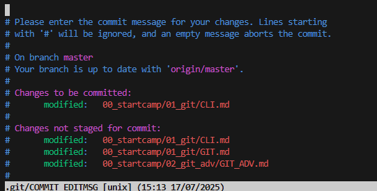

# GIT

## 버전 관리  

**GIT**: **분산** 버전 관리 시스템  
**버전 관리란**: 변화를 기록하고 추적하는 것  
<span style="color: #848482">EX) 카카오톡 버전 업데이트 </span>

  
<span style="color: #848482">[Fig 1.] 위의 그림은 git의 버전 관리를 비유한 것</span>  
특히 git은 '.git'이라는 숨겨진 폴더 내부에 파일을 저장해 버전을 관리함  

---

### 중앙 집중식과 분산식

**중앙 집중식** : 각 파일을 로컬에서 관리하기 때문에 각 파일이 원본이 됨  

**분산식** : 별도 저장소에서 파일 버전 정보를 저장하고 있기 때문에 개인이 파일을 '불러와서' 사용할 수 있음  

**분산식의 장점**
* 각 버전이 서로 다르게 기록되기 때문에, 개인이 다르게 수정해도 원본과의 충돌이 나지 않음
* 여러 사람이 한 번에 각자의 로컬에서 파일을 수정할 수 있음
* 각 로컬의 훼손에도 원본 파일은 훼손되지 않음

---
### git의 3가지 영역  

**working directory / staging area / repository**   

**working directory**: 현재 작업 중인 폴더  

**staging area**: working directory에서 변경된 파일 중, 다음 버전에 포함시킬 파일들을 선택적으로 추가하거나 제외할 수 있는 중간 준비 영역  
여기에 새로운 '파일들'이 등록된다. 각 파일을 취사 선택할 수 있음
<span style="background: #a6daf4; color: black">각 기능별로 version을 다르게 선택하는 게 좋고, 이를 취사 선택하는 구역이 staging area </span>  

**repository** : 버전 이력과 파일들이 영구적으로 저장되는 영역으로, 모든 버전, 변경 이력이 기록됨  
repository에 올라간 파일은 staging area에서 삭제된다.  

## GIT의 사용  
study folder에서 `$ git init`을 수행  

#### git init : 해당 폴더를 git으로 관리할 것이라 선언  
```bash
$ git init
```

  

<span style="color: #848482">[Fig 2.] 경로 옆에 <span style="color: #0EFCFE">(master)</span>가 생긴 것을 확인할 수 있음</span>  

  
<span style="color: #848482">[Fig 3.] 또한 <span style="color: #0EFCFE">.git</span> 폴더가 생긴 것을 확인할 수 있음</span>      

#### git add : working directory에서 staging area에 파일을 추가하는 코드  
```bash
$ git add 00_startcamp/01_git/markdown.md # add 이후 파일명
$ git add . # 현재 작업중인 디렉토리의 모든 내용을 추가할 수 있음
```
  
<span style="color: #848482">[Fig 4.] working directory에서 staging area에 파일을 추가하는 코드</span>  

#### git restore : staging area에 추가하지 않을 파일을 추가했을 때, 삭제하는 명령어

```bash
$ git restore --staged [filename]
```  

#### git status : 현재 working directory 및 staging area 현황을 보여줌  
  
<span style="color: #848482">[Fig 5.] 이전에 version 관리도 한 적이 없고 repository에 아무것도 없는 이 상황에서 git은 아무것도 추적하고 있지 않음</span>  

  
<span style="color: #848482">[Fig 6.] commit을 하기 위해서는 markdown.md 파일의 변화를 기록하는 것이 필요하다는 내용의 에러</span>  
다른 파일의 변동 사항에 대해서는 관심 없고, **이미 add된(staging area에 등록된) 파일만** git이 추적하고, 알람을 제공  

#### git commit : staging area에 올라온 변경된 파일을 저장하는 행위  

  
<span style="color: #848482">[Fig 7.] 제대로 안 됩니다! 왜냐면 누가, 언제 했는지 기록해야 버전 관리를 할 수 있기 때문에</span>  

commit의 필수 요건인 -m "commit message"를 추가하지 않으면  
vim으로 연결된다 -> ':q'를 입력해서 나가면 됨  


<span style="color: #848482">[Fig 8.] 이 화면이 vim. 여기를 빠져나가려면 <span style="color: #0EFCFE">:q</span> 를 입력하자</span>  


```bash
# config는 설정, global은 전역 설정을 위한 옵션
$ git config --global user.email "[email@]"  
$ git config --global user.name "[김땡주]" 
```  
➕ 각 PJT마다 로컬로 작성자를 설정할 수도 있음

#### git config : 작성자 설정

```bash
# 아래 코드는 설정된 전역 값을 확인하기 위한 옵션
$ git config --global --list
```  

```bash
# 사용자 계정의 숨겨진 gitconfig 파일을 VScode로 연다.
$ code ~/.gitconfig
```  

#### git log : commit history를 보여주는 명령어

```bash
$ git log
```

  
<span style="color: #848482">[Fig 8.] commit(저장)한 log를 확인할 수 있다.</span>


### Remote Repository  
---
: 코드와 버전 관리 이력을 온라인 상의 특정 위치에 저장해 여러 개발자가 협업하고 코드를 공유할 수 있는 저장 공간  

특히 우리는 GitLab을 사용할 것. 개인적인 repository  
해당 GitLab 내에서는 개인의 Repository를 서로 볼 수 없음.  
<span style="background: #a6daf4; color: black">따라서, 프로젝트 총괄을 위해 강사님을 초대해드려야 함</span>  


# GITHub 사용
> ❓ README.md를 추가여부  
README를 추가하면, .git 파일 생성 이후에 README.md를 추가해 최초 commit이 시행된 상태로 Repository가 생성됨  
❗ 따라서 이미 작업 중인 현재 폴더의 파일들을 업로드하기 위해서는 굳이 그렇게 할 필요 없음  

#### git remote add : 로컬 저장소에 원격 저장소를 추가하는 명령어로, 별칭을 통해 여러 개의 원격 저장소를 연결할 수 있음  
```bash
# origin 은 추가하는 원격 저장소 별칭
# 이후 원격 저장소 주소

$ git remote add origin [원격저장소 url]
```  

#### git remote -v : 현재 연결된 원격저장소 위치를 알려주는 명령어  

```bash
$ git remote -v  
```

#### git push : 원격저장소(repository)에 commit 목록을 업로드 하는 명령어  
```bash
# -u 는 저장을 위한 흐름을 옮김
# origin은 연결된 원격저장소를 의미함
# master는 원격저장소의 version을 의미함
$ git push -u origin master  
```  

#### git clone : 로컬에서 원격 저장소의 파일들을 불러와 사용하기 위한 명령어 - 처음 복제할 때만 사용
```bash
git clone [원격저장소 url]
```  