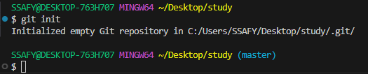

# GIT

## 버전 관리  

**GIT**: **분산** 버전 관리 시스템  
**버전 관리란**: 변화를 기록하고 추적하는 것  
&nbsp;&nbsp;&nbsp;&nbsp;&nbsp;&nbsp;&nbsp;&nbsp; EX) 카카오톡 버전 업데이트  

  

위의 그림은 git의 버전 관리를 비유한 것  
특히 git은 '.git'이라는 숨겨진 폴더 내부에 파일을 저장해 버전을 관리함

**중앙 집중식** : 각 파일을 로컬에서 관리하기 때문에 각 파일이 원본이 됨  

**분산식** : version 정보를 관리한다. 별도 저장소에서 파일 버전 정보를 저장하고 있기 때문에 개인이 파일을 '불러와서' 사용할 수 있음  

**분산식의 장점**
* 각 버전이 서로 다르게 기록되기 때문에, 개인이 다르게 수정해도 원본과의 충돌이 나지 않음
* 여러 사람이 한 번에 각자의 로컬에서 파일을 수정할 수 있음
* 각 로컬의 훼손에도 원본 파일은 훼손되지 않음

**git의 3가지 영역**  
working directory / staging area / repository  
**working directory**: 현재 작업 중인 폴더  
**staging area**: working directory에서 변경된 파일 중, 다음 버전에 포함시킬 파일들을 선택적으로 추가하거나 제외할 수 있는 중간 준비 영역  
여기에 새로운 '파일들'이 등록된다. 각 파일을 취사 선택할 수 있음
<span style="background-color: #ffdce0; color: black">각 기능별로 version을 다르게 선택하는 게 좋고, 이를 취사 선택하는 구역이 staging area</span>  
**repository**: 버전 이력과 파일들이 영구적으로 저장되는 영역으로, 모든 버전, 변경 이력이 기록됨  
repository에 올라간 파일은 staging area에서 삭제된다.  

# GIT의 사용  
* study folder에서 `$ git init`을 수행  

  
경로 옆에 (master)가 생긴 것을 확인할 수 있음  

  
또한 .git 폴더가 생긴 것을 확인할 수 있음  

  
working directory에서 staging area에 파일을 추가하는 코드  

  
이전에 version 관리도 한 적이 없고 repository에 아무것도 없는 이 상황에서 git은 아무것도 추적하고 있지 않다.  

  
commit을 하기 위해서는 markdown.md 파일의 변화를 기록하는 것이 필요하다고 얘기하고 있다.  
다른 파일의 변동 사항에 대해서는 관심 없고, 이미 add된(staging area에 등록된) 파일만 git이 추적하고, 알람을 준다.  

git commit을 하면 staging area에 올라온 변경된 파일을 저장하는 행위  
  
제대로 안 됩니다! 왜냐면 누가, 언제 했는지 기록해야 버전 관리를 할 수 있기 때문에.  


```bash
# config는 설정, global은 전역 설정을 위한 옵션
$ git config --global user.email "someone@gmail.com"  
$ git config --global user.name "김땡주" 
```  

```bash
# 아래 코드는 설정된 전역 값을 확인하기 위한 옵션
$ git config --global --list
```  

```bash
# 사용자 계정의 숨겨진 gitconfig 파일을 VScode로 연다.
code ~/.gitconfig
```  

```bash
# commit으로 저장한 파일을 확인할 수 있는 코드
$ git log
```

```bash
$ git restore --staged filename
```

