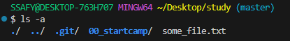

# GIT

## 버전 관리  

**GIT**: **분산** 버전 관리 시스템  
**버전 관리란**: 변화를 기록하고 추적하는 것  
&nbsp;&nbsp;&nbsp;&nbsp;&nbsp;&nbsp;&nbsp;&nbsp; EX) 카카오톡 버전 업데이트  

  

위의 그림은 git의 버전 관리를 비유한 것  
특히 git은 '.git'이라는 숨겨진 폴더 내부에 파일을 저장해 버전을 관리함  


### 중앙 집중식과 분산식
---

**중앙 집중식** : 각 파일을 로컬에서 관리하기 때문에 각 파일이 원본이 됨  

**분산식** : 별도 저장소에서 파일 버전 정보를 저장하고 있기 때문에 개인이 파일을 '불러와서' 사용할 수 있음  

**분산식의 장점**
>* 각 버전이 서로 다르게 기록되기 때문에, 개인이 다르게 수정해도 원본과의 충돌이 나지 않음
>* 여러 사람이 한 번에 각자의 로컬에서 파일을 수정할 수 있음
>* 각 로컬의 훼손에도 원본 파일은 훼손되지 않음


### git의 3가지 영역  
---
**working directory / staging area / repository**   

> **working directory**: 현재 작업 중인 폴더  

> **staging area**: working directory에서 변경된 파일 중, 다음 버전에 포함시킬 파일들을 선택적으로 추가하거나 제외할 수 있는 중간 준비 영역  
여기에 새로운 '파일들'이 등록된다. 각 파일을 취사 선택할 수 있음
<span style="color: #ffdce0">각 기능별로 version을 다르게 선택하는 게 좋고, 이를 취사 선택하는 구역이 staging area</span>  

>**repository** : 버전 이력과 파일들이 영구적으로 저장되는 영역으로, 모든 버전, 변경 이력이 기록됨  
repository에 올라간 파일은 staging area에서 삭제된다.  

## GIT의 사용  
study folder에서 `$ git init`을 수행  

**git init** : 해당 폴더를 git으로 관리할 것이라 선언  
```bash
$ git init
```

  

[Fig 1.] 경로 옆에 <span style="color: #0EFCFE">(master)</span>가 생긴 것을 확인할 수 있음  

  
[Fig 2.] 또한 <span style="color: #0EFCFE">.git</span> 폴더가 생긴 것을 확인할 수 있음  
  
     


**git add** : working directory에서 staging area에 파일을 추가하는 코드  
```bash
$ git add 00_startcamp/01_git/markdown.md # add 이후 파일명
$ git add . # 현재 작업중인 디렉토리의 모든 내용을 추가할 수 있음
```
  
[Fig 3.] working directory에서 staging area에 파일을 추가하는 코드  

**git status** : 현재 working directory 및 staging area 현황을 보여줌  
  
[Fig 4.] 이전에 version 관리도 한 적이 없고 repository에 아무것도 없는 이 상황에서 git은 아무것도 추적하고 있지 않음  

  
[Fig 5.] commit을 하기 위해서는 markdown.md 파일의 변화를 기록하는 것이 필요하다는 내용의 에러  
다른 파일의 변동 사항에 대해서는 관심 없고, **이미 add된(staging area에 등록된) 파일만** git이 추적하고, 알람을 제공  

**git commit** : staging area에 올라온 변경된 파일을 저장하는 행위  

  
제대로 안 됩니다! 왜냐면 누가, 언제 했는지 기록해야 버전 관리를 할 수 있기 때문에  


```bash
# config는 설정, global은 전역 설정을 위한 옵션
$ git config --global user.email "someone@gmail.com"  
$ git config --global user.name "김땡주" 
```  
각 PJT마다 로컬로 작성자를 설정할 수도 있다.

```bash
# 아래 코드는 설정된 전역 값을 확인하기 위한 옵션
$ git config --global --list
```  

```bash
# 사용자 계정의 숨겨진 gitconfig 파일을 VScode로 연다.
code ~/.gitconfig
```  

```bash
# commit으로 저장한 파일을 확인할 수 있는 코드
$ git log
```

```bash
# 실수로 staging area에 추가하지 않을 파일을 추가했다면
# 아래의 코드로 삭제할 수 있음
$ git restore --staged filename
```

  
나의 로그를 확인할 수 있다.  

### Remote Repository  
---
: 코드와 버전 관리 이력을 온라인 상의 특정 위치에 저장해 여러 개발자가 협업하고 코드를 공유할 수 있는 저장 공간  

특히 우리는 GitLab을 사용할 것. 개인적인 repository  
해당 GitLab 내에서는 개인의 Repository를 서로 볼 수 없음.  
> 따라서, 프로젝트 총괄을 위해 강사님을 초대해드려야 함  


# GITHub 사용
README.md를 추가할까 말까
-> README를 추가하면 .git 이후에 readme.md를 추가해서 최초 commit이 시행된 상태로 repository가 생성되고 저장된다는 특징이 있음  
현재 작업 중인 폴더의 파일들을 업로드하기 위해서는 굳이 그렇게 할 필요 없음  

**git remote add** : 원격저장소 위치를 알려준다.  
```bash
$ git remote add origin https:// # add 이후 원격저장소 주소 
```  
여러 개의 원격저장소에 저장할 수 있다는 특징이 있음. 동일한 방식으로 원격저장소를 알려주면 된다.  

**git remote -v** : 현재 연결된 원격저장소 위치를 알려준다.  
```bash
$ git remote -v  
```

**git push** : 원격저장소(repository)에 저장  
```bash
# -u 는 저장을 위한 흐름을 옮김
$ git push -u origin master  
```  