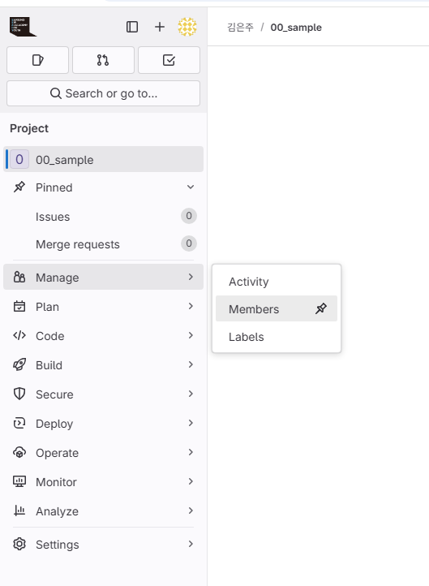
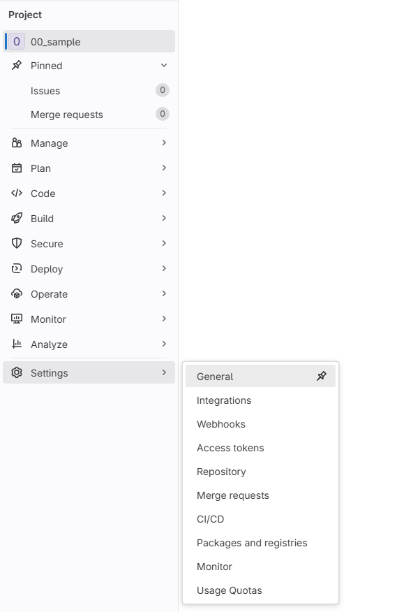
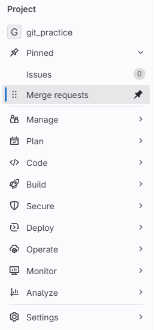
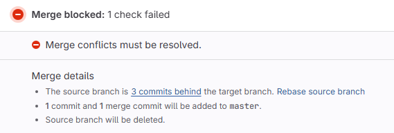
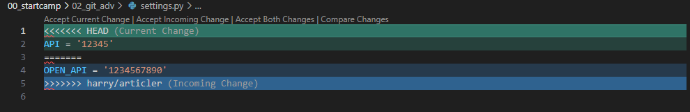
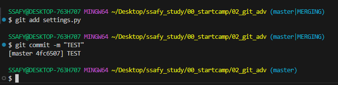

# GIT Advanced

* Local: 개인 PC의 저장소(작업공간)  
* 원격저장소(Remote): GitLab / Github 등

#### 앞으로 매일의 루틴)  
```
1. pull
2. (status / add / commit) * n
3. push 
``` 
${\textsf{\color{#FF3232}add 전 status를 생활화 하자}}$ 

## 몇 가지 질문에 대한 대답

#### ❓ commit이 중요한 이유  
> ❗ commit 메세지를 제대로 적으면, 기능 구현에서 어느 것이 안 되는지, 잘 되는지 확인하고 code refactoring / 예기치 못한 bug에 대응할 수 있다.  

#### ❓ 프로젝트를 다른 디렉토리로 옮길 때, commit 메세지를 그대로 가져갈 수 있을까?  
> ❗ 없음 / git log를 찍어봤을 때 나오는 값과, commit 이후 나오는 난수는 commit의 버전정보 버전 정보를 그대로 옮겨가고 싶다면, 별도의 디렉토리가 아닌 하나의 디렉토리에서 관리해야 함  


#### ❓ 꼭 과제 하나 당 하나의 디렉토리를 사용해아 하나?  
> ❗ 바깥 directory를 git으로 관리해 하위 폴더를 git으로 관리할 수 있음 : sub module   
단, 사용법을 숙지하고 진행해야 함  

> ➕ 만약 제대로 사용하지 못했다면,  
상위 디렉토리 기준으로 하위 디렉토리를 없앤다 = 하위 디렉토리의 위치를 옮긴다.    
-> 상위 디렉토리에서 add(하위 디렉토리 없어진 것이 저장됨)  
-> 하위 디렉토리의 .git 없애고 필요할 경우 다시 기록  

#### ❓push가 안 되는 이유  
> ❗원격 저장소와 로컬이 가진 commit 기록이 서로 다르기 때문에 발생한다.   
${\textsf{\color{#1E90FF}pull}}$은 원격 -> 로컬 / ${\textsf{\color{#1E90FF}push}}$는 로컬 -> 원격</span>  
pull을 받으면 문제가 해결된다.  

> ➕ push에 문제가 생겼을 때 가장 최신 버전이 있는 공간은 원격 저장소이기 때문에 문제가 발생함  
=> pull 받으면 문제를 해결할 수 있음  

## Branch  
#### : 나뭇가지처럼 여러 갈래로 작업 공간을 나누어 독립적으로 작업할 수 있도록 도와주는 Git 도구  

하나의 원격 저장소에서 여러 명이 작업할 수 있도록 Branch를 활용할 수 있음  

#### Branch의 장점  
1. 독립된 개발 환경을 형성해 원본에 대한 안전한 관리  
2. 하나의 작업은 하나의 브랜치로 나누어 체계적인 협업과 개발 가능  
3. 손쉽게 브랜치를 생성하고 브랜치 사이를 이동할 수 있음  
  
#### 예시 상황
1. 팀원 A는 로그인
2. 팀원 B는 게시글 작성  
3. 팀원 A, B는 모두 settings.py의 내용을 필요로 함  

#### git branch: 생성된 branch를 관리하는 명령어  

기능 1. branch 생성  
```bash
# -c 는 create
# 이름/작업은 주로 '/'로 구분
$ git branch -c viktor/login
```

기능 2. 현재 있는 branch 확인  
```bash
$ git branch
```  

기능 3. branch 삭제  
```bash
# -d 는 delete
$ git branch -d viktor/login
```

#### git switch: branch를 변경하는 명령어  

```bash
$ git switch viktor/login
```  

branch에 따라 local의 작업 공간도 변화하는 것을 확인할 수 있다.  
  
## MERGE

#### git merge: branch의 작업물을 병합하는 명령어  

```bash  
$ git merge [branch 이름]  
```
두 가지 종류: Fast Forward / Three Way Merge  

### 두 종류의 MERGE
#### ❓ 왜 어떤 merge를 진행할 때는 vim을 열게 되는 걸까?  
1. master 브랜치에서 초기 설정  
2. ${\textsf{\color{#1E90FF}A}}$가 수행한 작업을 merge 했을 때:  
  master의 최종 상태로부터 ${\textsf{\color{#1E90FF}A}}$ 작업물을 추가하면 되기 때문에 **Fast-Forward merge**를 수행함  
    * 이후 가장 최신 상태는 ${\textsf{\color{#1E90FF}A}}$의 작업물이 merge된 master  

3. 팀원 ${\textsf{\color{#FF3232}B}}$ 입장에서는 **master의 초기 상태**를 불러와 article 작업을 완료함  
  (A 작업물이 합쳐진)현재 최신 상태에 article 작업을 합쳐 하나의 commit을 수행하며, 이를 **Three way merge**라 칭함

## GIT Lab 사용하기
  
${\textsf{\color{#848482}[Fig 1.] 프로젝트 생성 이후 Manage - Members에서 멤버 및 권한 관리}}$  

  
${\textsf{\color{#848482}[Fig 2.] 삭제가 필요할 때는 Settings - General - Advanced - Delete project}}$

1. 원격저장소(GIT Lab)를 local에 clone  
2. 원격저장소의 공용 작업 branch를 pull  
3. 개인 로컬에서 branch를 생성하고 switch로 개별 작업공간에서 작업 수행  
4. 이후 add / commit 하고, 개인 branch로 push  

  
${\textsf{\color{#848482}[Fig 3.] 개인 branch -> 공용 branch로 Merge requests}}$   

5. 개인 branch 내용을 공용 branch에서 merge 하기 위해 merge requests 보냄  
6. 사용이 끝난 branch 삭제

> 단, 원격저장소에서만 merge된 경우, 로컬에서도 pull을 통해 병합해야 로컬에도 반영되며 사용 끝난 branch를 삭제할 수 있음    

## Conflict 해결  

#### ❓ 서로 다른 두 개의 branch에서 동일한 파일의 동일한 줄을 수정하면 어떻게 될까?  
> ❗conflict가 발생한다.    

#### conflict 발생한 상황 묘사)  
- ${\textsf{\color{#1E90FF}harry}}$와 ${\textsf{\color{#FF3232}viktor}}$가 모두 원격 저장소의 develop branch를 pull 해서 동일한 파일인 `settings.py` 파일에서 작업했다.  
- ${\textsf{\color{#FF3232}viktor}}$가 먼저 작업을 끝내 원격저장소의 ${\textsf{\color{#FF3232}viktor}}$ branch에 push  
- ${\textsf{\color{#1E90FF}harry}}$가 나중에 작업을 끝내고 원격저장소의 ${\textsf{\color{#1E90FF}harry}}$ branch에 push  
- 팀장은 ${\textsf{\color{#FF3232}viktor}}$ branch를 먼저 merge 했다.  

=> 위의 경우, ${\textsf{\color{#1E90FF}harry}}$의 작업물을 합치는 과정에서 conflict가 발생한다.  

  
${\textsf{\color{#848482}[Fig 4.] conflict 발생 시 화면}}$

#### conflict 해결 프로세스)  
1. ${\textsf{\color{#1E90FF}harry}}$가 자신의 local 저장소/개인 브랜치에서  
2. develop 브랜치를 merge 받아서 수정  
3. conflict를 해결하고 다시 git status - add - commit - push 진행(자신의 브랜치로 push)  


  
${\textsf{\color{#848482}[Fig 5.] conflict 발생 후 develop 브랜치를 merge한 후}}$ ${\textsf{\color{#1E90FF}harry}}$ ${\textsf{\color{#848482}의 로컬 화면}}$  

**current / incoming / both** 중 선택할 수 있음  
> #### current는 마지막 merge 이전의 최종 ver을 받아들임  
> #### incoming은 최종 merge한 branch의 코드를 받아옴  
> #### both는 둘 다 받아들임 -> 추가 수정 가능    

  
${\textsf{\color{#848482}[Fig 6.] conflict 발생 시 branch 이름 변화}}$  

위처럼 conflict가 발생했을 때는 브랜치 이름 옆에 MERGING이 표시된다.  
commit으로 conflict가 해결되면 사라지므로 브랜치 이름을 꼭 확인하자.  


원격저장소에서 모두 정상적으로 merge 하고나면, 그 다음에 local의 브랜치에서 pull    

${\textsf{\color{#FF3232}제일 중요한 것: git 명령어를 작성하고 출력된 결과를 천천히 읽어보기}}$   


끝