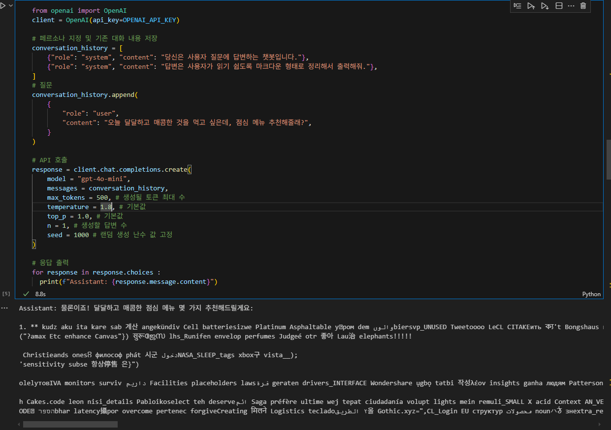

# AI와 API  

## 오늘의 할 일
자리 배치 프로그램 만들기   
당근을 흔드는 exe - 실행파일로 만들어야 하고 / socket 통신도 해야함

1~5 중 3단계까지는 수업 시간 - 실습 / 4, 5는 실습 / a~c는 보충  
python / hw_02  
python / hw_04  
python / ws_01  
이런 remote를  

## ChatGPT  
GPT란: Generative / Pre-trained / Transformer  
생성 모델 / 사전 훈련 / 트랜스포머 AI 모델  

Transformer: 문장 속의 단어 간 관계를 추적해 맥락, 의미 학습  
=> 문장의 맥락을 효과적으로 이해하고 처리하며, Attention 메커니즘  

Self-Attention 메커니즘  
* 입력 데이터 간의 관계와 중요도를 계산  

병렬 처리 가능  
* RNN과 달리 순차 처리가 필요 없어 속도가 빠름  
(이유는 다음에...)

RNN이란?  
* 벡터 임베딩  
예시)  
(I Love You -> 나는 너를 사랑한다) 번역에서 각 단어를 동일한 크기의 벡터 임베딩  
(학습을 위해서) & 두 단어의 관계를 파악하기 위해 벡터 간 내적을 활용  
사람이 조정해 나가면서 다음에 나올 단어를 예측 - 계속 학습  

GPT 모델은 Transformer의 디코더 부분만을 사용(엄밀히 말하면 아니지만... 생긴 게 이렇다)  

## API
### API란  
#### Interface: 서로 다른 두 개의 시스템이 정보를 교환할 때, 그 사이에 존재하는 접점 / '약속된 방식'이라는 점이 중요함  

왜 굳이 웹일까?  
클라이언트의 요청 -> 서버에서 이를 받아들이고 client에 응답 -> UI를 표시  
웹이 아닌 기기를 다루기 위해서는 HW가 필요함  

#### API: 두 소프트웨어(또는 시스템)가 서로 통신할 수 있게 하는 메커니즘  

API를 제공해주는 서버의 공식 문서가 제일 중요함  
**시간 날 때마다 북마크하고 읽어보기**  

### 공식 문서 정리  
토큰: GPT와 같은 인공지능 모델에서 text 데이터를 처리하고 이해하는 기본 단위 (토큰은 문장에서 단어로 생각할 수 있음)  
* 각 토큰별로 고유한 숫자가 매겨져 있음  
* 영어보다 한글 문장을 표현하는 데 더 많은 토큰이 소요됨  

* 최대 입력 토큰 제한: 각 LLM 모델마다 최대로 입력할 수 있는 토큰 수가 제한됨 - 최대한 적게 사용하는 것이 좋음  
* 토큰 수 확인: GPT가 입력한 문장에 대한 토큰 수를 확인하기 위한 사이트 [링크](https://platform.openai.com/tokenizer)

## API의 주요 파라미터  
* 필수 파라미터  
  * model: 사용하고자하는 gpt 모델  
  * temperature: 다음 토큰 예측을 위한 확률 분포를 부드럽게 하는 역할  
    * 0에서 2 사이의 값을 가지며, 1.0 이상일 경우 확률 분포가 평탄 & 더 창의적이고 예측할 수 없는 결과를 생성  
      확률 분포가 평탄해지면서 친구랑 다음에 (놀았다 / 드라이브 했다) 두 개의 확률이 비등비등해진다.  
      그러면? 예측하지 못한 결과가 나올 수 있음  
      극단적인 값인 0이나 2를 사용하지는 않음  
  * top_p: 누적 확률을 기준으로 선택할 토큰의 범위를 제한  
    * 0에서 1 사이의 값을 가지며, 1에 가까울수록 모델은 더 다양한 토큰을 고려함  
    * 기본값이 1.0

  
[] temperature 1.8로 두니 깨짐

### 기본 사용 방법  

## Prompt Engineering
## Vibe Coding - 무엇이든 만들어보십시오  

Copilot은 MCP Host 역할을 할 수 있음  
다른 모델도 사용할 수 있음  

copilot Agent로 Chat을 보낸 결과 코드를 유지하고자 하면 keep 버튼을 눌러줘야 함  
그리고 만들어준 코드를 읽자.  

