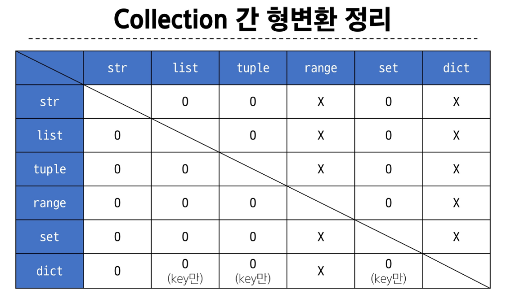

# data types  

`데이터 타입 객체.메서드()`  
형식으로 사용  

메서드는 클래스 내부에 정의되는 함수로, 클래스는 파이썬에서 '타입을 표현하는 방법'  
help 함수를 통해 str을 호출해보면 class라는 것을 확인 가능  

## sequence types  
#### 여러 개의 값들을 순서대로 나열하여(!= 정렬) 저장하는 자료형  
ex) str, list, tuple, range  

sequence types의 특징  
1. 순서
2. 인덱싱
3. 슬라이싱
4. 길이
5. 반복  

### str  
문자들의 순서가 있는 "변경 불가능한" 시퀀스 자료형  
* 순서가 중요한 자료가 되기 때문에, 순서를 함부로 바꿀 수 없음  

### f-string  
문자열에 f 또는 F 접두어를 붙이고 표현식을 {expression}으로 작성해 문자열에 파이썬 표현식 값을 삽입할 수 있음  
복잡한 결과물을 {}에 삽입했을 때 값을 이해하기 어려우므로  

### list
여러 개의 값을 순서대로 저장하는 "변경 가능한" 시퀀스 자료형  
0개 이상의 객체를 포함하며, 데이터 목록을 저장  

L.pop(i) 메서드가 있지만 사용하지 않을 것  

### tuple  
문자들의 순서가 있는 "변경 불가능한" 시퀀스 자료형  
'파이썬 내부 동작'에서 주로 사용됨  

### range  
연속된 정수 시퀀스를 생성하는 변경 불가능한 자료형  

* 증가 값이 음수이면 감소, 증가 값이 양수이면 증가  
* 증가 값이 0이면 에러  

## Non-Sequence Types  

### dict  
key-value 쌍으로 이루어진 순서와 중복이 없는 자료형  
python에서는 hash table을 직접 구현할 필요 없이 dict를 사용하면 됨  
* key는 변경 불가능한 자료형만 사용 가능 - str, int, float, tuple, range ...  
* 고유한 value를 찾을 수 없게 되기 때문에  
* value는 모든 자료형 사용 가능  

D.get(k) : 키 k로부터 value를 가져옴  
❓ get 메서드가 존재하는 이유  
❗ dict[k] 를 사용했을 때는 key error 발생 / 메서드 사용 시 None 반환  
필요한 때에 적절히 사용하면 됨  

### set  
: 순서와 중복이 없는 "변경 가능한" 자료형  

set의 집합 연산  
* (set_1 | set_2)  합집합  
* (set_1 - set_2)  차집합  
* (set_1 & set_2)  교집합  

* add로 추가 / remove로 삭제  
set은 순서가 없기 때문에 remove 내부에 삭제할 값을 지정해줘야 함  

## 복사  
* 파이썬은 변경 가능한 데이터 타입 / 변경 불가능한 데이터 타입 따라서 복사의 방법이 달라짐  
* 변경 가능한 데이터 타입의 복사 -> 동일한 주소를 가리킴  

list에서 얕은 복사  
```python
a = [1, 2, 3]  
b = a[:]
b[0] = 100  
# output
# a: [1, 2, 3]
# b: [100, 2, 3]
```  
## Type Conversion  
### 명시적 형 변환  
  
직접 한번 해보세요~  
