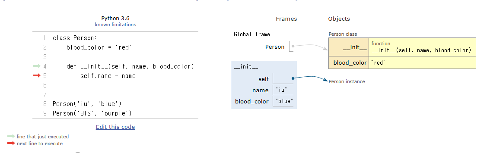

## 클래스와 객체

클래스(가수)와 객체(아이유)  
=> 타입(list) : 클래스를 만든다 == 타입을 만든다  

객체 뒤에 '.'을 찍고 메소드를 사용할 수 있음  

## 객체 정리
* 타입: 어떤 연산자와 조작이 가능한가  
* 속성: 어떤 상태(데이터)를 가지는가  
* 조작법: 어떤 행위(함수)를 할 수 있는가  

# 클래스  
## 클래스 정의  
* class 키워드  
* 클래스 이름은 파스칼 케이스 방식으로 작성  

## 클래스 변수와 인스턴스 변수  
### 클래스 변수 활용  
* 가수가 몇 명인지 확인하고 싶다면?
: 인스턴스가 생성될 때마다 클래스 변수가 늘어나도록 설정 가능  

클래스 변수의 값을 변경하고 싶다면 인스턴스 이름을 사용하는 것이 아니라, 클래스 이름을 사용해야 한다.  
```python
class Circle:
  pi = 3.14

  def __init__(seld, r):
    self.r = r

c1 = Circle(5)
c2 = Circle(5)
Circle.pi = 5 
print(c1.pi) # 5
print(c2.pi) # 5
```  

### 인스턴스 메서드  
* 클래스로부터 생성된 각 인스턴스에서 호출할 수 있는 메서드  
* 반드시 첫 번째 매개변수로 인스턴스 self를 전달받음  

### 클래스 메서드  
: 클래스가 호출하는 메서드 - 클래스 변수를 조작하거나, 클래스 레벨의 동작 수행  
* @classmethod 데코레이터를 사용해 정의  
* 호출 시. 첫번째 인자로 해당 메서드를 호출하는 클래스(cls)가 전달됨  
(cls는 self같은 역할을 수행함)  

인스턴스로 클래스 메서드를 호출할 수도 있음 (하지 않을 거지만...)  

### 정적 메서드  
: 클래스 / 인스턴스와 상관없이 독립적으로 동작하는 메서드  
* @staticmethod 데코레이터를 사용해 정의  

### 인스턴스와 클래스 간 name space  
* 클래스 정의 => 클래스와 해당하는 이름 공간 생성  
* 인스턴스를 만들면 => 인스턴스 객체가 생성 / 독립적인 name space 생성  
* 인스턴스에서 특정 속성 접근 => 인스턴스 > 클래스 순으로 탐색 (❗LEGB와 다름)  

  
[Fig 1. 인스턴스와 클래스의 name space 시각화]  

# 상속  
: 다른 클래스의 메소드, 변수를 받아오는 것  

## 다이아몬드 상속 문제  
* MRO 알고리즘을 사용해 클래스 목록 생성  
* 상속된 속성들의 검색을 C3 선형  
* 계층 구조에서 겹치는 클래스 두 번 검색 X  

```python
O = object
class D(O):
    pass
class D(O): pass
class E(O): pass
class F(O): pass
class B(D, E): pass
class C(D, F): pass
class A(B, C): pass

# A 클래스의 상속 탐색 순서 출력
print(A.__mro__)
```

```bash
(<class '__main__.A'>, <class '__main__.B'>, <class '__main__.C'>, <class '__main__.D'>, <class '__main__.E'>, <class '__main__.F'>, <class 'object'>)
```  

`class C(F, D): pass`일 때 상속 탐색 순서는 아래와 같음 (1:30)  

#### A의 MRO  
A - B - C - F - D - E - O

#### 과정
B의 상속 mro: B-D-E-O  
C의 상속 mro: C-F-D-O  
머리부터 본다: B를 보고, B를 방문한 적이 없으며, mro의 머리에 있기 때문에 B를 A의 mro에 추가  
이후 B가 제거된 mro에서 D를 본다. 하지만 D는 C의 상속 mro에 포함되어 있기 때문에 지금 추가하지 않음  
-> 대신 C를 A의 mro에 추가  
이어서 D를 살피지만, D가 다른 mro의 '머리가 아니'면서 포함되어 있기에 F를 A의 mro에 추가  
그리고 D가 두 mro 모두에서 머리가 되기 때문에 A의 mro에 추가  
그 다음으로 E를 A의 mro에 추가하고, O를 추가한다.  


처음 설계할 때부터 잘 설계해서 하면 좋을 것 같음 - 다중 상속에 대해 지금은 고민할 필요 없음 -> 나중에 필요할 때 다시보기  

## super()  
: 부모 클래스(또는 상위 클래스)의 메서드를 호출하기 위해서 사용하는 내장 함수  
super()를 호출할 때, 누가 호출되는지 잘 생각해서 실행해야 한다.  
C가 A, B를 순서대로 다중 상속 받은 경우 `super()` 는 A를 가리킨다.  
이후는 MRO를 따른다. 

혹시 특정 class의 변수, 메서드를 자식 클래스에서 사용하고 싶다면  
`ParentA.speak()` 와 같은 방식으로 사용할 수 있음  

# 참고  
## 매직 메서드  
* 인스턴스 메서드  
* 특정 상황에 자동으로 호출되는 메서드  
* Double underscore(__)가 있는 메서드는 특수한 동작을 위해 만들어진 메서드  
* 스페셜 메서드 혹은 매직 메서드라고 불림  

## 데코레이터(Decorator)  
: 다른 함수의 코드를 유지한 채로 수정하거나 확장하기 위해 사용되는 함수  

## 제너레이터  
제너레이터는 `iter()`를 간단하게 만드는 역할을 담당함  
### 제너레이터 구조  
* 일반적인 함수처럼 작성  
* `yield` 문을 사용해 값을 반환  