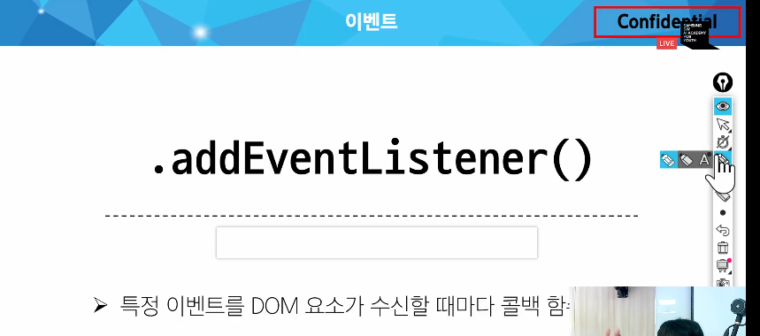

# JS
## History of JS  
### ECMAScript  
: Ecma International이 정의하고 있는 표준화된 스크립트 프로그래밍 언어 명세  

### ECMASctipt와 JS  
* JS는 ECMAScript 표준을 구현한 구체적인 프로그래밍 언어  
* ECMAScript의 명세 기반으로 웹 브라우저 / Node.js와 같은 환경에서 실행됨 - JS의 사용 이유  
* ECMAScript는 JS의 표준 & JS는 ECMAScript 표준을 따르는 구체적인 프로그래밍  

ECMAScript는 ES5, ES2015(ES6) 이후를 중요하게 보기 때문에 이 이후로 나온 버전을 관심있게 살핌  

## 변수데이터 타입  

### 식별자 작성 규칙  
* 반드시 문자, 달러('$') (View 수업 할 때 등장할 것)  

### 변수 선언 키워드 3가지  
1. let  
  * block 스코프를 갖는 지역 변수 선언  
  * 재할당 가능  
  * 재선언 불가능  
  ```javascript
  /*가능*/
  let dump = 50
  dump = 60 
  ```
  ```javascript
  /*불가능*/
  let dump = 50
  let dump = 60 
  ```
2. const
  * 블록 스코프를 갖는 지역 변수 선언  
  * 재할당 불가능  
  * 재선언 불가능  
  * ES6에서 추가
  **따라서 처음 선언할 때 값을 반드시 할당해줘야 함**  
  ```javascript
  /*불가능*/
  const dump = 50
  dump = 60 
  ```
  ```javascript
  /*불가능*/
  const dump = 50
  const dump = 60 
  ```  
3. var - 사용하지 않음  

### Block scope  
* if, for, 함수 등의 '중괄호 내부'를 가리킴  
* 블록 스코프를 가지는 변수는 바깥에서 접근 X - 당연하긴 해  

❓LET과 CONST 중 어떤 것을 사용하면 좋을까  
> ❗const를 사용하게 될 것!!!!  

### 데이터 타입  
**원시 자료형(Primitive type)**: Number, String, Boolean, null(None), undefined(할당조차 안 됨)  
  EX)  
  * 변수 할당될 때 값이 복사됨  
  * 변수 간 서로 영향 미치지 않음  
  ```javascript
  let a = 10
  let b = a
  b = 20
  console.log(a) // 10
  console.log(b) // 20
  ```
**참조 자료형(Reference type)**: Objects(Object, Array, Function)  
  EX)  
  * 객체를 생성하면 객체의 메모리 주소를 변수에 할당  
  * 변수 간에 서로 영향을 미침  
  ```javascript
  const obj1 = {name: 'Alice', age: 30}  
  const obj2 = obj1  
  ```

❓ 재할당이란  
> 어떤 변수에 다른 값을 대입하는 것을 재할당이라고 하는데, 다른 type의 값을 대입할 수도 있고, 만약 참조 자료형을 const롱 정의하면 index 사용한 개별 값은 다른 값으로 변경 가능 -> 🔥 체크  

### Template literals  
```javascript
const age = 100
const message = `홍길동은 ${age}세입니다.` 
```  

### null과 undefined  
null: 변수의 값이 없음을 의도적으로 표현할 때 사용  
typeof null은 object로 출력된다 - 설계 당시의 버그 해결 X  

### Boolean  
소문자로 적음(true / false)  

## 연산자  
### 증가 & 감소 연산자  
* 증가 연산자 ('++')  
* 감소 연산자 ('--')  

### 동등 연산자(==)  
* '암묵적 타입 변환' 사용  
```javascript  
console.log('1' == 1) // true
console.log(0 == []) // true  
console.log("0" == []) // false
```
### 일치 연산자(===)
* '암묵적 타입 변환' X  
```javascript
console.log('1' === 1) // false
```  

### 논리 연산자  
* and 연산 - &&  
* or 연산 - ||  
* not 연산 - !  

## 제어문  
### 조건문 - 삼항 연산자  
```javascript
condition ? expression1 : expression2
```  
true: expression1  
false: expression2

### 반복문 - for문  
index 변수에 let 쓸 거임  
```javascript
for (let i = 0; i < 6; i++){}
```  
### 반복문 - for...in  
: 객체의 열거 가능한 속성(property)에 대해 반복 - 문자열, 배열 등에는 적용하면 안 됨  
예를 들면, 해쉬 테이블에 적용할 수 있음  
* 순서가 있는 object(배열, 문자열 등)에 대해선 인덱스 순으로 순회하는 것처럼 보이지만 실제로 그것이 보장되지 않음  

### 반복문 - for...of  
: 반복 가능한 객체(배열, 문자열 등)에 대해 반복  
```javascript
for (const number of numbers) {}
```

# DOM
## DOM이란  
: The Document Object Model  
웹 브라우저에서의 JavaScript  
: 웹 페이지의 동적인 기능을 구현  
* 웹 페이지를 구조화된 객체로 제공 -> 프로그래밍 언어가 페이지 구조에 접근할 수 있는 방법 제공  
* 문서 구조, 스타일, 내용 등을 변경할 수 있도록 함  

### DOM 특징  
* DOM에서 모든 요소, 속성, 텍스트는 하나의 객체  
* 모두 document 객체의 하위 객체로 구성됨  

### DOM tree  
: 브라우저는 HTML 문서를 해석하여 DOM tree라는 객체 트리로 구조화  

### document 객체  
: 웹 페이지 전체를 가리키는 객체  

## DOM 선택  
### 선택 메서드  
document를 조작하려고 한다면 document 객체가 가진 method를 사용해야 함  
`document.querySelector(selector)`  
제공한 선택자와 일치하는 한 개의 element를 선택  
```javascript
console.log(document.querySelector(.contents)) // contents 클래스의 첫 번째 element를 불러옴
```
`document.querySelectorAll()`  
제공한 선택자와 일치하는 여러 element를 선택  
* 제공한 CSS selector를 만족하는 NodeList 형태로 가져와줌  

## DOM 조작  
### 속성 조작  
1. 클래스 속성 조작  
  **classList method**  
  : add, remove, toggle을 사용해 클래스 값을 추가 / 제거할 수 있음  

2. 일반 속성 조작  
  `Element.getAttribute(name)` : 해당 요소에 지정된 값을 반환(조회)  
  `Element.setAttribute(name, value)`: 지정된 요소 값을 설정  
  `Element.removeAttribute(name)`: 지정된 요소 삭제  

### HTML 콘텐츠 조작  
text~~
### DOM 요소 조작  
**DOM 요소 조작 메서드**  
* `document.createElement(tagName)`  
  : 작성한 tagName의 HTML 요소를 생성하며 반환  

* `Node.appendChild()`  
  : 한 Node를 부모 Node의 자식 NodeList중 마지막으로 추가
* `Node.removeChild()`

### 스타일 조작  
**스타일 지정할 때 왜 변수 재할당 방식을 사용하지 않는지, 그것이 무슨 의미인지 생각해보자**  

# 함수  
: Function 객체 - 참조 자료형  

## 함수 정의  
```javascript
function name(param1, param2){
  statements
  return value
}
```  
**return type 안 정해주면 undefined로 반환됨**  
### 함수 정의 2가지 방법  
선언식: 함수를 선언하는 방식  
표현식: 함수 표현식을 객체로 만들어 함수에 할당하는 것  
```
const funcName = function () {}
```  
❓ 선언식과 표현식 중 어느것을 많이 사용할까?
> ❗ 표현식을 많이 사용할 것 - 호이스팅되지 않아서  

## 매개변수  
### 1. 기본 함수 매개변수 (Default function parameter)  
:  

❓ 인자 < 매개변수
>❗ 그냥 undefined 넣어줌  

❓ 인자 > 매개변수
>❗ 지정된 개수까지만 받아옴  

## Spread syntax(전개 구문) 🔥   
: 배열이나 문자열과 같이 반복 가능한 항목 펼치는 것  

## Arrow function expressions  
```javascript
const arrow = function (name) {
  return `hello, ${name}`
}
```  
```javascript
const arrow = name => `hello, ${name}`
```  
불필요한 기능을 지우고, function 기능을 대체하는 것이 '=>', 함수의 return은 당연하기 때문에 'return'을 지움  
이렇게 쓸 수 있는 상황도 한정되어 있고, 원하면 작성 과정을 살피면 됨  
❓ 근데 이거 왜 써야하나...
> ❗ 충격! object를 사용할 때 신경써야 하는 부분을 없애주는 압도적인 장점이 있음!!  

# 이벤트  
## event 객체  
: DOM에서 무언가 일어났다는 신호, 사건이 발생했을 때 생성되는 객체  

## event handler  
: 이벤트가 발생했을 때 

## .addEventListener()  
: DOM 요소(이벤트 객체)의 메서드로, event handler를 부착해주는 역할을 수행함  
  
```javascript
EventTarget.addEventListener(type, handler)
```  

개발자 도구 - Event Listeners에서 이벤트에 따른 동작이 정의된 내용을 확인할 수 있음  

## 버블링  
이벤트가 상위 상위 상위 요소로부터 내려옴  
window(창) - body - form - div - p (02-bubbling 참고)  
따라서, **버블링**: evetnd 객체에 의한 동작이 하위 요소로부터 상위로 올라가는 과정  

약관 전체 동의처럼 부모 요소를 동의했을 때 내부 요소들을 모두 클릭하는 경우가 생길 수도 있음  

하지만, 버블링을 활용해볼 수도 있을 것  
=> 작은 항목을 선택해도 상위 요소의 클릭 결과만 반환하는 것이 가능  
=> 이벤트는 부모 요소가 관리하도록 하면서, target을 지정할 수도 있음  

++ 캡처링: 버블링과 반대  

## event handler 활용  

### target과 currentTarget의 이해  
**style을 <script> 내에서 바로 사용하면 명시도에 문제가 생기므로, style 설정에선 <style> 구문과 class를 활용한다.**
ul tag의 자식들인 li tag에게 click 이벤트가 벌어진다.  
그 이벤트는 부모 요소에게 bubbling 되며, 자식에게 click이 발생해도, 부모는 그 사실을  

자식 요소인 li 태그에 무슨 일이 벌어지면, 조건 분기를 수행하도록 하자.  
그 때 사용하며, 기억해야 하는 것이 target과 currentTarget의 차이이다.  
```javascript
console.log(event)
console.log(event.target) // target은, 그 이벤트가 실제로 벌어진 요소 - 각 버튼이 출력됨
console.log(event.currentTarget) // currentTarget은 이벤트의 주체
console.log(event.target.id) // 이벤트가 실제로 벌어진 요소의 id를 출력함
```

### 이벤트의 기본 동작 취소하기  
* 기본 동작이 있는데, 이걸 하지 않도록...
`.preventDefault()`  
🔥🔥 여기서부터 - 수업 때 다루지 않은 내용 실습하며 익히기~
🔥 classList, className

# 참고  
* semicoloe 선택적으로 사용 가능  