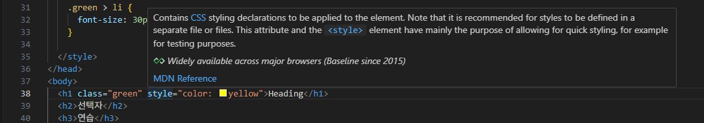

# CSS (Cascading Style Sheet)  

## CSS를 html에 적용하는 방법  
1. 내부에 `<style>` 적용
2. 인라인 스타일
* 인라인 스타일 쓰지 마세요  
3. 외부 style 파일 적용 
 
## CSS Selectors 종류  
### 기본 선택자  
* 전체 선택자(*): HTML 모든 요소 선택  
* 클래스 선택자('.'): 주어진 클래스 속성을 가진 모든 요소 선택  
* 아이디 선택자('#'): 

```css
  <style>
    /* 전체 선택자 */
    * {
      color: red;
    }
  </style>
```

  

```css
<style>
  /* 전체 선택자 */
  * {
    color: red;
  }

  h2 {
    color: orange;
  }

  .green {
    color: green;
  }

  #purple {
    color: purple;
  }
</style>
```


결과를 바탕으로 style 코드의 우선순위를 생각해보자  

### 결합자 (Combinators)  

* 자손 결합자와 자식 결합자의 차이는 무엇일까?  
  * 공백 구분은: 자손 결합자 - 직계 자식이 아니어도 적용 가능  
  * '>' 구분은: 자식 결합자 - 직계 자식이어야 적용 가능


```css
.green li {
  color: brown;
}

.green > li {
  font-size: 30px;
}
```
  

## 웹 스타일링  
### Specificity (명시도)  
* 여기서 cascade의 비밀이 밝혀짐  
동일한 명시도에서는 아래쪽 내용이 우선순위를 가짐  

### 명시도가 높은 순 - 시험 때는 외우라^^  
1. Importance  
  - !important  **극단적이라 자주 쓰지는 않을 것**
2. Inline 스타일  
  - 명시도를 뭉개버리고 우선순위를 높이기 때문에 사용하지 말라는 것  
3. 선택자  
  - id선택자 > class 선택자 > 요소 선택자 : id는 문서 전체에 하나만 있어야 하며, 그 다음은 속성을 묶은 class  
4. 소스 코드 선언 순서  
5. 상속 속성  

=> "green" class를 가진 ul 내부의 <li> 내부 값들의 색깔이 변하지 않은 이유  


❓중첩에서는?
> 2개의 class를 가지고 있는 경우, 명시도가 더 높아짐  


  
우선순위는 이렇게 확인할 수 있음  

  
inline style은 따로 specificity가 출력되지는 않음  

### CSS 속성 2가지 분류  
* 상속되는 속성  
  * text 모델

* 상속되지 않는 속성  
  * box 모델 - 사이즈가 바깥 box / 내부 box 동일하면 곤란하겠죠  

실습 4번으로 알아보는 상속 내용  
각 요소들은 inherited가 기본적으로 yes인 요소와 no인 요소로 구분할 수 있고, no인 경우에도 'inherit' 요소를 사용해서 상속받을 수 있음  
사용 방법은 아래와 같음  
'상속 받는 대상'을 기준으로 inherit를 작성해야 정상적으로 작동됨  

```html
<!DOCTYPE html>
<html>
<head>
  <meta charset="utf-8">
  <style>
    .text-red {
      color: red;
      border: 1px solid #bcbcbc;
      padding: 10px;
    }
    .text-red button {
      color: inherit;

    }
  </style>
</head>
<body>
  <div class="text-red">
    <h1>Heading</h1>
    <p>Paragraph<strong>strong</strong></p>
    <button>Button</button>
  </div>
</body>
</html>
```


## CSS BOX Model
### Outer display type - block 특징  
* width와 height 속성 사용 가능  
* 테두리를 통해 각 태그에 대한 block 크기를 지정해 줄 수 있음  
* 해당 내용 주변으로 아무 요소도 올 수 없도록 함  
* padding-border-margin(안에서 바깥으로 순서)로 인해 다른 요소를 상자로부터 밀어냄  

### Outer display type - inline 특징  
* a, img, span, strong, em 등의 대표적인 타입  
* `<span>여기</span>` 이런 식으로 사용해 개행하지 않고 특정 부분의 스타일 지정 가능  
* 내용 크기만큼 존재함  
* paddin, margin, border 적용되지만 수평 방향으로만 다른 요소를 밀어낼 수 있음  

++ inline block도 있음  

NEXT) Inner display type  

flex(Inner display type)를 사용해 block 내부의 요소들을 자식으로 관리할 수 있음  

### CSS 스타일 가이드  
* 코드 구조와 포맷팅
  * 마지막 속성 뒤에는 ; 넣기  
* 선택자 사용
  * class 선택자 우선적으로 사용 - id를 남발하면 의미 퇴색  
* 명명 규칙: kebab-case  

**CSS의 모든 속성은 외우는 것이 아님**

### MDN Web Docs  
Mozilla Developer Network에서 제공하는 온라인 문제  
웹 개발자와 디자이너를 위한 종합적인 참고 자료  
HTML, CSS, JS, API, 개발 도구 등 정보 제공  