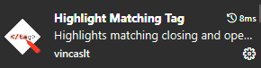
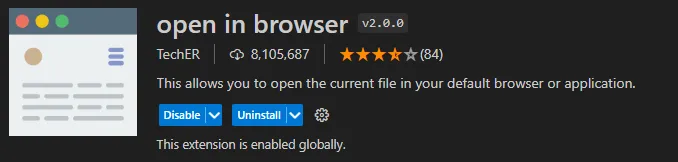

# 개요  

빨리 기능 개발을 하고 싶은 마음은 이해하지만, 사용자가 활용하기 편리한 것을 만드는 것도 중요  

Hypertext: 웹 페이지를 다른 페이지로 연결하는 링크  
참조를 통해 사용자가 한 문서에서 다른 문서로 즉시 접근할 수 있는 텍스트  

### Markup Language  
태그 등을 이용해 문서와 데이터의 구조를 명시하는 언어 ex) HTML, Markdown  

Markup Language 등은 style이 지정되어 있기 때문에 출력 결과처럼 보임  
#### Markup Language 예시  
```HTML
<h1>HTML</h1>
<p>HTML이란 Hyper Text Markup Language의 약자이다.</p>
```  

## HTML 구조  

`<!DOCTYPE html>`
* 해당 문서가 html로 문서라는 것을 나타냄  

`<html></html>`  
* 전체 페이지의 콘텐츠를 포함  

`<title></title>`  
* 브라우저 탭 및 즐겨찾기 시 표시되는 제목으로 사용  

head 태그 내부에 meta 태그를 사용해 meta data를 입력함  
head 태그 내부는 HTML 문서에 관련된 설명 설정 등, 컴퓨터가 식별하는 메타데이터를 작성하며  
사용자에게 보이지 않음  

### HTML Element  
하나의 요소는 여는 태그와 닫는 태그, 그리고 그 안의 내용으로 구성됨  
닫는 태그는 태그 이름 앞에 슬래시가 포함  
* 닫는 태그가 없는 태그도 존재 : 사용자에게 보여주고 싶으나, 닫을 필요가 없는 데이터 ex) 이미지 

### HTML Attributes  
* HTML에서 클래스는 동일한 속성과 동작을 하나로 묶어주는 역할  
아래 class부터가 Attribute  
`<p class="editor-note">`  : 다음의 내용을 editor-note로 묶는다는 뜻

### HTML Attributes 작성 규칙  
1. 요소 이름과 속성 사이에 공백이 있어야 함  
2. 하나 이상의 속성들이 있는 경우, 속성 사이 공백으로 구분  
3. **대소문자 구분 X**  

kebab-case: ex) `editor-note`  

  
역할: <h1>를 하이라이팅 했을 때, </h1>를 같이 하이라이팅 해서 언제 끝나는지 알려줌  

  
역할: <h1>을 수정할 때 </h1>도 함께 수정해줌  

  
역할: `alt` + `B`로 html 바로 실행해볼 수 있음  

## 웹 구조화  
`h1`태그를 사용했을 때, 기존의 목적과 별개로 '큰 글씨'가 되는 이유는 무엇일까?  
- 별도의 style(user agent style)이 적용됨 : browser에서 지원함  

## HTML 스타일 가이드  
* 속성 값에는 큰 따옴표를 사용하는 것이 일반적 (JS와 구분 위해)  
* 코드 구조와 포맷팅  
  * 일관된 들여쓰기 (2칸 공백)  
  * 중첩은 한 단계 더 들여쓰기

* 공백 처리  
* 에러 출력 없음 - 문법 오류 있어도 별도의 에러 메시지 출력 X  

## 실제 문서 제작 시 팁 - sementic tag를 사용하자  
<header>
<nav>
<aside>
<section>
<article>

강조는 <strong>