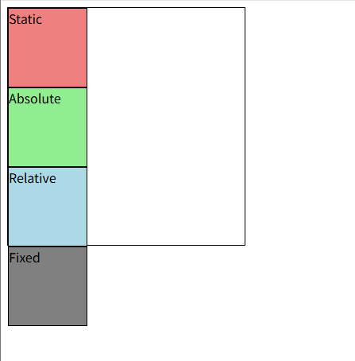
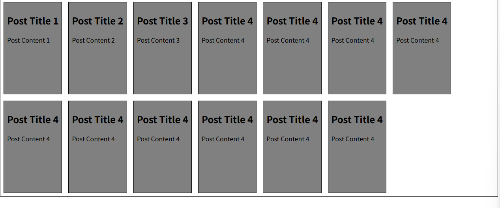

## CSS Box Model  
: 웹 페이지의 모든 HTML 요소를 감싸는 사각형 상자 모델  

**Outer display type**  
: 박스가 문서 흐름에서 어떻게 동작할지를 결정

**Outer display type - block**  
: 항상 새로운 행으로 나뉨, width와 height 속성을 사용하나, 같은 행의 남는 공간에 다른 요소가 올 수는 없음  
padding, margin, border로 다른 요소를 상자로부터 밀어냄  
width 속성 지정 X 시 inline 방향 사용 가능한 공간 모두 차지함  

**Outer display type - inline**  
: 새로운 행으로 넘어가지 않고, width와 height 속성을 사용할 수 없음.  
수직 방향으로는 padding, mragin, border가 적용되지만, 다른 요소를 밀어낼 수는 없음  
수평 방향으로는 다른 요소를 밀어낼 수 있음  

**Inner display type**  
: 내부의 속성들을 제어하는 기능을 가지는 display type / 대표적으로 flex가 있음  
박스 내부의 요소들이 어떻게 배치될지를 결정함  

❓ 자식 요소와 Inner display type의 차이점은 무엇일까?  
> ❗ 자식 요소는 물리적인 개념. 바깥의 부모 요소에 속해있는 요소  
한편, Inner display type은 '자식 요소를 제어하는 기능' 자체를 의미하는 추상적 개념  

shorthand 속성 
- 'border' : border-width, border-style, border-color를 한번에 설정하기 위한 속성으로, 작성 순서는 영향 X  
- 'margin' & 'padding': 순서가 중요하므로, 익혀둬야함  

```css
/* 4개 - 상우하좌 */
margin: 10px 20px 30px 40px;
padding: 10px 20px 30px 40px;

/* 3개 - 상 / 좌우 / 하 */  
margin: 10px 20px 30px;
padding: 10px 20px 30px;

/* 2개 - 상하 / 좌우 */  
/* 1개 - 상하좌우 */
```  

shorthand에서 요소 값이 3개일 때, 상 / 좌우 / 하인 이유  
: 문단을 결정하는 상 / 하를 중요하게 생각함. 또한 좌우는 동일하게 가져갈 때가 기능을 완성할 때 도움이 됨  

css는 border box가 아닌, content box의 크기를 width 값으로 지정 -> box-sizing 속성으로 border box를 선택할 수 있음  

**Inline-block**  
: inline과 block 요소 사이의 중간 지점을 제공하는 display 값  
* width 및 height 속성 사용 가능  
* padding, margin 및 border로 인해 다른 요소가 상자에서 밀려남  
* 새로운 행으로 넘어가지 않음  
> 요소가 줄바꿈 되는 것을 원하지 않으며, width, height 갖도록 하고 싶을 때  

'none' : 요소를 화면에 표시하지 않고 공간조차 부여되지 않음  
❓ 어디에 쓸 수 있을까?  
> ❗ 사용자에게는 보이지 않아도 되지만, 렌더링 되어야 할 때  

## CSS Position  
: 위의 내용들만으로는 한 화면을 구성하는 것이 어렵다.  
각 요소의 위치와 크기를 조정해 웹 페이지의 화면 구성을 결정  
요소를 Normal Flow에서 제거해 다른 위치로 배치하는 거 -> 다른 요소 위에 올리기, 화면의 특정 위치에 고정시키기 등  

### CSS Layout  
: 각 요소의 위치와 크기를 조정해 웹 페이지의 디자인을 결정  
Display, Position, Flexbox 등  

### position 유형  
1. static
2. relative - 다른 요소의 layout에 영향을 주지 않음   
3. absolute   
4. relative  
5. fixed  

  

Absolute를 옮기면 Normal Flow를 따라서 Relative box가 위로 올라옴  
Absolute: 절대적인 영점을 기준으로 top, left 등을 반영해서 움직임, 자기가 차지하고 있는 공간은 비움 (= 차지하지 않음)  
Reletive: Normal Flow 따르는 자신의 기존 위치를 기준으로 top, left를 반영해 움직임, 자기가 차지하고 있던 공간을 그대로 차지함  
Fixed: 스크롤을 내려도 위치 고정
특히 absolute는 왼쪽 상단 모서리 꼭짓점을 영점(기준)으로 한다는 점 주의  

container에 relative 요소를 추가했을 때, Absolute가 딱 맞아 떨어짐 => 자신의 조상 중 position이 relative인 요소를 기준으로 하는데, 만약 아예 없다면 좌상단 꼭짓점을 기준으로 함  

- Position 요소들별 동작 정리 내용 읽어보기  

### sticky  
fixed와의 차이점: fixed는 처음부터 끝까지 한 자리를 유지하지만, sticky는 본인의 자리에 있다가 top이 0이 되는 시점에 그 위치에 고정됨  

### z-index  
: 요소의 쌓임 순서(stack orde)를 정의하는 속성  
* 정수 값을 사용해 Z축 순서를 지정함    
* static이 아닌 요소에만 적용됨  
* z-index 값이 클수록 요소가 위에 쌓이게 됨  
* 부모의 z-index가 낮으면 자식 z-index가 아무리 높아도 부모 z-index가 높은 요소보다 위로 올라올 수 없음  
* z-index 값이 같으면 HTML 문서 순서대로 쌓임 = 나중에 정의된 것이 위에 쌓임  


## CSS Flexbox  
: 요소를 행과 열 형태로 배치하는 '1차원' 레이아웃 방식  
flexbox를 만들면, 자손X '자식 요소'에 대해서만 관여할 수 있음  
❓ 자손 요소를 Flex로 관리하고 싶으면?  

축을 기죽으로 flext item들을 배치함: flex-direction으로 변경할 수 있음   
* main axis (주 축): 기본은 row(수평), flex item들이 배치되는 기본 축    
* cross axis (교차 축): 기본은 col(수직), main axis에 수직인 축    

### Flex Container  
: display: flex; 혹은 display: inline-flex; 가 설정된 부모 요소  
* 이 컨테이너의 **1차 자식 요소들**이 Flex Item이 됨  

### Flex Item  
: Flex Container 내부에 레이아웃 되는 항목  

`display: flex;`를 통해서 주축을 바탕으로 정렬되는 것을 확인할 수 있음  

flex-wrap: flex container의 한 행(주축)에 들어가지 않을 경우 다른 행에 배치할지 여부 설정 
flex-wrap: wrap이면 기존의 높이 유지 X / 작아짐  
그래도 요소가 너무 많으면 범위를 넘어감  

  

Flex의 목적은 배치 / 공간 분배 / 정렬에 있음  
속성명 Tip)  
justify와 align - justify: 주 축 / align: 교차 축  

## 참고  
### Margin collapsing (마진 상쇄)  
* 두 block 타입 요소의 margin top과 bottom이 만나면 **더 큰 margin으로** 결합되는 현상  

### BLock 요소의 수평 정렬  
❓ justify-self 및 justify-items 속성이 없는 이유
: margin auto 쓰면 되니까 = 필요 없기 때문  

inline 요소에서의 수평 정렬은 text-align을 사용  

수직 정렬은 여러가지 방법이 많지만, layout을 사용하는 방법이 flex이기 때문에 flex 사용하는 것 추천  

