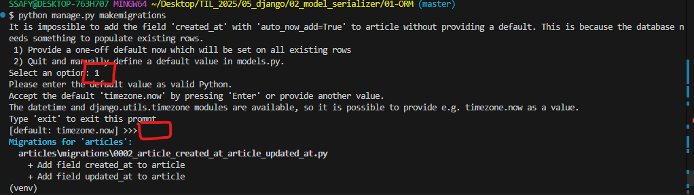
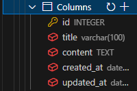

# Model
: DB의 테이블을 정의하고, 데이터를 조작할 수 있는 기능 제공  
= 테이블 구조를 설계하는 blueprint  

## model 클래스 작성  
```python
# articles/models.py

class Article(models.Model):
  title = models.CharField(max_length=10)
  content = models.TextField()
```

* model 클래스는 django.db.models 모듈의 Model이라는 부모 클래스 상속받음  

django는 default로 sqlite3를 사용함: 데이터 사이에 구분이 희미함  

## 제약 조건  
: 데이터가 올바르게 저장되고 관리되도록 하기 위한 규칙  
위의 Article 클래스에서 `max_length=10`을 지정한 것처럼  

# Migratinos  
: model 클래스의 변경사항(필드 생성, 수정 삭제 등)을 DB에 최종 반영하는 방법  

## Migrations 과정  
model class로 설계도 초안 -> (makemigrations) -> migration 파일: 최종 설계도 -> db.sqlite3  

migration 파일을 만드는 코드   
```bash
$ python manage.py makemigrations
```

migrate  
```bash
$ python manage.py migrate
```  

migrate를 끝내면 DB에 반영된 내용을 확인할 수 있음  

## 추가 모델 필드 작성  
이미 생성된 테이블에 필드를 추가해야 할 때는, `models.py`의 class 변경한다.    
* 이미 기존 테이블이 존재하기 때문에 필드를 추가할 때 기본값 설정이 필요 -> models.py를 수정하고 migration 파일을 생성하면  

아래와 같은 결과: 1 or 2를 선택할 수 있음  

```bash
$ python manage.py makemigrations
It is impossible to add the field 'created_at' with 'auto_now_add=True' to article without providing a default. This is because the database needs something to populate existing rows.
 1) Provide a one-off default now which will be set on all existing rows
 2) Quit and manually define a default value in models.py.
Select an option: 1
```

1. 현재 대화를 유지하면서 직접 기본 값 입력  
2. 현재 대화에서 나간 후 models.py에 기본 값 관련 설정을 하는 방법  

선택한 다음, 별도의 입력을 주지 않으면 Default 값을 선택해 구성할 수 있음  

```bash
Please enter the default value as valid Python.
Accept the default 'timezone.now' by pressing 'Enter' or provide another value.
The datetime and django.utils.timezone modules are available, so it is possible to provide e.g. timezone.now as a value.
Type 'exit' to exit this prompt
[default: timezone.now] >>>
```



migrations 과정이 종료되면 2번째 migration 파일이 생성된 것을 확인할 수 있음  
이처럼 Django는 설계도를 쌓으며 문제가 생겼을 시 복구 or 되돌릴 수 있도록  
만약 migrations 정보를 삭제하고 싶다면 numbering 된 `py` 파일들만 삭제하면 된다.  

**model class에 변경사항이 생겼다면, 반드시 새로운 설계도를 생성하고, 이를 DB에 반영해야 함**  
위 과정을 끝내면 DB에 변동사항이 반영된 것을 확인할 수 있음  



최상단에 gitignore가 있으면 하위에서 gitignore를 만들지 않아도 됨  
: 항상 상대 경로를 기준으로 하기 때문  

# ORM  
: Object-Relational-Mapping  
객체 지향 프로그래밍 언어를 사용해 호환되지 않는 유형의 시스템 간 데이터 변환하는 기술  
`Article.objects.all()` Model class인 Article을 Manager인 objects가 따라다니며 객체  

article 객체를 그냥 넘겨주면 obj가 들어있기 때문에 문제가 된다  
객체를 딕셔너리로 변환해서 JSON으로 넘겨주기로 했다  
```python
def model_to_dict(article):
    '''
    Article 객체를 딕셔너리로 변환하는 함수
    :param article: Article 객체
    :return: Article 객체를 딕셔너리로 변환한 결과
    '''
    return {
        'id': article.id,
        'title': article.title,
        'content': article.content
    }

```

# Serialization  
: 여러 시스템에서 활용하기 위해 데이터 구조나 객체 상태를 나중에 재구성할 수 있는 format으로 변환하는 과정  
즉 -> 사용자가 input으로 넣은 data에 serializer를 수행해서 JSON으로 변환  


# 추가  
put과 fetch는 다르다  

is_valid() 결과로 유효성 검사를 통과하지 못했을 경우 `raise_exception` 옵션을 is_valid()내부에 활용할 수 있음  