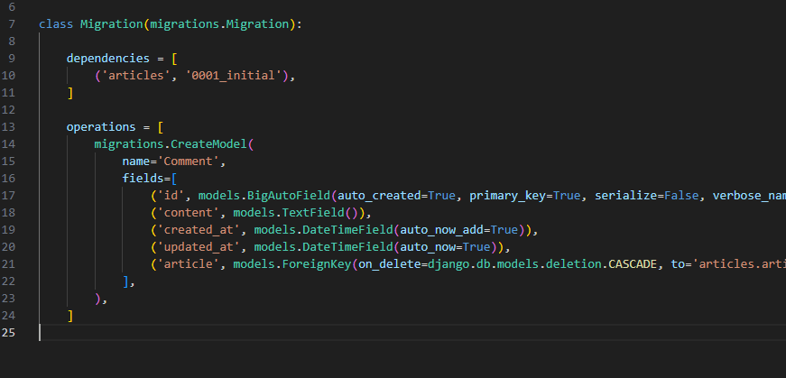

# 이전 내용들
Serializer 클래스에 인스턴스 생성 위한 인자 전달시, 키워드 인자를 써야하는 이유?  
```python
class Some:
    def __init__(self, arg1, arg2='default', arg3='default', ...):
        pass
s1 = Some('arg1', arg3='other data')
```
Serializer에 기대하는 첫 번째 데이터는 articles이므로 request.data는 data라는 인자 정보를 함께 줘야함  

# Many to one relationships
N:1) 한 테이블의 0개 이상의 레코드가 다른 테이블의 레코드 한 개와 관련된 관계    
- Ex) 0개 이상의 댓글은 1개의 게시글에 작성될 수 있다.(N:1)  

class를 새로 만들고 나서, 관계를 생각한다.  
N:1의 관계를 갖게 하려면 어떻게 해야할까?   

* 트리에서 나의 왼/오 자식을 알게 하려면 따로 class에 변수를 만들어 저장해주면 됨  
=> N:1의 관계에서는 댓글이 게시글을 가리키도록 저장(일반적으로 id를 따라가도록 함)  

Comment의 id와 Article의 id는 구분되어야 하기 때문에 comment class에서 'Article에 대한 외래키'라 정의함  

`models.ForeignKey(to, on_delete)`
on_delete는 data 무결성 위해 사용하는 속성

```python
article = models.ForeignKey(Article, on_delete=models.CASCADE)  # 1
article = models.ForeignKey('articles.Article', on_delete=models.CASCADE) # 2
```
위의 1번처럼 설정하는 article을 정의하는 것이 가장 편리하겠지만, class 정의 순서를 따르기 때문에 안전한 방법으로 2번을 택할 수 있음  

* ForeignKey 클래스를 작성하는 위치와 관계없이 테이블 필드 마지막에 생성됨  
* 파일 이름과 함께 클래스를 불러올 때는, 클래스 이름의 첫 글자의 capital 여부는 상관 X  
* 참조 클래스 이름은 소문자 사용을 권장 & 객체로 받을 때 단수형 추천ㄴ

# 관계 모델 참조  
## 역참조  
: N:1 관계에서 1에서 N을 참조하거나 조회하는 것 1->N  
> 특정 게시글에 작성된 댓글을 조회하고 싶은데, comment class에만 ForeignKey로 article이 저장되어 있기 때문에(N:1) 역참조를 사용해 comment를 article 기준으로 보일 수 있도록 해줌   

## related manager 이름 규칙  
`article.comment_set.all()`  
related manager, 즉 역참조 이름은 따로 설정하는 것이 아니라, `objects`처럼 모델을 정의하면 그 이름으로 바로 사용할 수 있음  
related manager는 N:1, M:N 관계 모두에서 역참조 시에 사용하는 매니저이다.  

* **serializer.save() 과정에서 ForeignKey 값을 지정해 저장할 수 있음**  
  만약 해당 내용을 생략하면, ForeignKey를 별도 추가시켜줘야 입력 성공 응답을 받을 수 있음  
  ```python
  article = Article.objects.get(pk=article_pk)
  serializer.save(article=article)
  ```  

### 읽기 전용 필드(read_only_fields)  
* 데이터를 전송 받은 시점에 유효성 검사에서 제외, 데이터 조회 시에는 출력하는 필드  
위에서 특정 필드를 선택한 경우나, 내부에서 추가 선언을 통해 출력한 경우에는 읽기 전용 필드를 지정할 수 없음(동작하지 않음)  
```python
# 동작
class Meta:
    model = Comment
    fields = '__all__'
    read_only_fields = ('article', )
```
```python
# 동작하지 않음
class Meta:
    model = Comment
    fields = ('content', )
    read_only_fields = ('article', ) 
```
```python
# 동작하지 않음
class CommentSerializer(serializers.ModelSerializer):
    class ArticleTitleSerializer(serializers.ModelSerializer):
        class Meta:
          model = Article
          fields = ('title', )
    article = ArticleTitleSerializer(read_only=True)
    class Meta:
        model = Comment
        fields = ('content', )
        read_only_fields = ('article', ) 
```

## View 로직 개선: annotate 사용  
: **annotate**는 `Django ORM` 함수로 SQL의 집계 함수를 활용해 쿼리 단계에서 데이터 가공 수행  
아래의 코드를 수행하면 `article` 객체에는 `num_of_comments`라는 annotate(주석) 필드가 포함됨  
```python
# articles/views.py
# 장고가 갖고 있는 집계 함수
from django.db.models import Count

@api_view(['GET', 'DELETE', 'PUT'])
def article_detail(request, article_pk):
    article = Article.objects.get(pk=article_pk)
    
    # annotate 함수로 데이터 가공 - article을 참조하는 comment 모델 개수를 셈
    # Count 내에는 count 하고자 하는 모델명
    article = Article.objects.annotate(num_of_comments=Count('comment')).get(
        pk=article_pk
    )

    # article 객체가 num_of_comments를 갖고 serializer로 전달됨
    if request.method == 'GET':
        serializer = ArticleSerializer(article)
        return Response(serializer.data)
    
```

```python
# articles/serializers.py
# 게시글 조회 할 때 해당 게시글의 댓글도 함께 조회
class ArticleSerializer(serializers.ModelSerializer):
    class Meta:
        ...
    
    num_of_comments = serializers.SerializerMethodField()

    # get_<필드명>이라고 명명해야 정상작동됨
    def get_num_of_comments(self, obj):
        # 여기서 obj는 Serializer가 처리하는 Article 인스턴스
        # view에서 annotate한 필드를 그대로 사용 가능 - fields 내용에 추가되어서 나오는 것을 확인할 수 있음
        return obj.num_of_comments
```

## SerializerMethodField  
SerializeMethodField를 Serializer 클래스 내에서 필드로 선언하면, DRF는 `get_<필드명>`이라는 이름을 가진 메서드 자동 찾음  


# ManyToMany  
1:N만으로는 모든 것을 표현할 수 없다.  
Many to many relationships  
N:M or M:N  
한 테이블의 0개 이상의 레코드가 다른 테이블의 0개 이상의 레코드와 관련된 경우  

= 양쪽 모두에 대해 1:N 관계를 정의한 상태를 만들어야 함  

Django에서는 'ManyToManyField'로 중개모델 자동 생성  

## 역참조 매니저 충돌  
* N:1 - 주 강사로 참여하는 강좌 `user.article_set.all()`  
* N:M - 보조 강사로 참여하는 강좌 `user.article_set.all()`  
서로 같은 이름을 사용하기 때문에 충돌 발생  
> teacher와 관계된 ForeignKey 혹은 ManyToManyField 둘 중 하나에 related_name 작성이 필요함  

```python
assistant_teachers = models.ManyToManyField(Teacher, related_name="assistant_courses")
```
위와 같은 방식으로 `related_name`을 지정 -> 뒤에 set을 붙이지 않고, 해당 이름을 manager로 역참조  


M:N의 관계에서는 Course가 강사를 가지지 않을 수도 있음(0도 가능)  
'symmetrical' arguments  
True일 경우: source 모델의 인스턴스가 target 모델의 인스턴스를 참조 -> 자동으로 target 모델 인스턴스도 source 모델 인스턴스 참조(대칭)  
False일 경우: 대칭 X  
- 여기서 source: 관계를 시작하는 모델  
- target 모델: 관계의 대상이 되는 모델  

through arguments  
* 사용하고자 하는 중개모델을 지정  
* 일반적으로 추가 데이터를 M:N 관계와 연결하려는 경우에 활용  


# 참고  
`Article.objects.get(pk=article_pk)`  
라는 코드에서 `pk`를 쓸 수도 있고, `id`를 쓸 수도 있음 - primary_key로 자동으로 만들어줌 - migration 파일 참고!!  
`pk`와 `id`를 공용으로 쓸 수 있는 건, drf가 models의 primary key가 없을 경우 id라는 기본 pk를 만들어주기 때문  
다른 `pk`를 지정할 수도 있음  
아래와 같은 방식으로    
  
