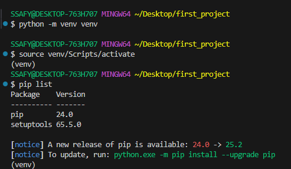

## Framework  
: 웹 앱을 빠르게 개발할 수 있도록 도와주는 도구  
(개발에 필요한 기본 구조, 규칙, 라이브러리 등을 제공)  

### 왜 Django인가!  
* 다양성  
* 확장성  
* 보안  
* 커뮤니티 지원  

## 가상 환경  
: Python 앱과 그에 따른 패키지들을 격리해서 관리할 수 있는 독립적인 실행 환경  

  

위와 같이 가상환경을 만들 수 있음  

### 의존성 패키지 목록 생성  
`$ pip freeze > requirements.txt`  
: 현재 설치되어 있는 패키지 목록을 `requirements.txt` 라는 파일명을 가진 새 파일로 만들어줌  
❓ freeze는 언제 하면 좋을까요?  
> ❗ 새로운 패키지 install & uninstall 할 때마다!    

나중에 집에 가서  
`$ pip install -r requirements.txt`  
를 통해서 동일한 버전의 패키지들을 사용할 수 있음  

### Django PJT 생성
`$ django-admin startproject firstpjt .`  

## Django Design Pattern  
### 디자인 패턴  

### MVC 디자인 패턴  
(Model, View, Controller)  
: 앱을 구조화하는 대표적인 패턴   
(데이터 & UI & 비즈니스 로직)  

### MTV 디자인 패턴: Django 디자인 패턴  
(Model, Template, View)  
: 사용자에게 보여주는 곳이 Template / 개발자가 수정하는 Controller가 View => 단순한 명칭 변경  

## Django application  
: 독립적으로 작동하는 기능 단위 모듈  
`$ python manage.py startapp articles`  
- 앱 생성하고 나서, 프로젝트 폴더 내부 `settings.py`의 INSTALLED_APPS 에 생성한 앱 추가

## API  
: Application Programming Interface  
두 SW가 서로 통신할 수 있게 하는 메커니즘  

### REST  
Representational State Transfer  
: API Server를 개발하기 위한 일종의 SW 설계 '방법론'  
* REST 원리를 따르는 시스템을 RESTful 하다고 부름  
* "자원 정의" "자원에 대한 주소 지정" 전반적인 방법  

1. 자원의 "식별" - URI  
2. 자원의 "행위" - HTTP Methods  
3. 자원의 "표현" - JSON 데이터  

> ⭐ 코드는 항상 위 순서대로 적을 것!  

### 식별  
: 인터넷에서 리소스(자원)를 식별하는 문자열  
> 가장 일반적인 URI는 웹 주소로 알려진 'URL'  

### 행위  
: 리소스에 대한 행위(수행하고자 하는 동작)를 정의  
#### HTTP response status codes  
5개의 응답 그룹

- Successful responses: 2XX  
- Client error responses: 4XX  
- Server error responses: 5XX  

### 표현  
: 개발자 입장에서 JSON을 응답으로 받는 경우가 많아짐  

## 요청과 응답  
### DRF - 사전 준비
- 사용자 요청을 받는 곳을 만들어야 함    
Django REST framework  
: Django에서 Restful API 서버를 쉽게 구축할 수 있도록 도와주는 오픈소스 라이브러리  
`$ pip install djangorestframework`  
: 설치 이후 사용할 수 있도록, settings.py를 수정함  

코드를 구현할 때는 식별 - 행위 - 표현  

`urls.py`에서 url을 수정하고, app 내부 views.py를 수정해서 기능을 구현함  

### URLs  
* articles 패키지에서 views 모듈을 가져와 사용  
* **url 경로는 반드시 slash로 끝나야 함**  

이후에 app에서 view 함수 정의  

* @api_view() 는 DRF view 함수에서는 필수로 작성됨  
* 기본적으로 GET 메서드만 허용됨  

### JsonResponse()  
* Django에 내장된 HTTP 응답 클래스  
첫번째 위치 인자로 JSON으로 변환 가능한 데이터를 받아와 응답 객체 반환  
* view 함수의 첫번째 인자 request는 httpRequest 객체를 받아옴  

### Variable Routing  
: URL 일부에 변수를 포함시키는 것  
```python
# <variable_name>
path('article/<variable_name>/', views.detail),
# <int:variable_name>: 정수만 허용
path('article/<int:variable_name>/', views.detail),
```
```python
# 동작하도록 하려면 detail 함수를 정의할 때 입력받은 article_pk 라는 변수를 그대로 가져가 사용
path('article/<int:article_pk>/', views.detail),
```

### App URL mapping  
: 각 앱에 URL을 정의하는 것 => 프로젝트와 각 앱이 URL을 나누어 관리를 편하게 하기 위함  

#### 활용 이유
기능이 많으면: 경로가 여러 개일 수밖에 없음  
따라서, 여러 개의 앱을 사용하고, 경로도 여러 개 만들어야 함  
PJT가 커지면 -> app마다 경로 따로 관리하는 것이 편리하므로, include라는 기능을 사용

**프로젝트 내부 `urls.py`**
```python
from django.urls import path, include

urlpatterns = [
    path('admin/', admin.site.urls),
    # include로 articles에 대한 경로는 해당 앱의 urls로 넘겨줌  
    path('articles/', include('articles.urls'))
]
```  

**app 내부 `urls.py`**  
```python
from django.urls import path
from . import views

urlpatterns = [
    path('index/', views.index),
    # 이미 pjt url에서 articles라고 정의함  
    # 따라서 articles라고 표기할 필요가 없음
    path('<int:article_pk>', views.detail)
]
```

## venv 활용 주의  
* venv 폴더는 위치 옮겨쓰지 않기  
만약 pjt 폴더 옮겨야 한다면, requirements.txt 만들고, venv 삭제 후 프로젝트 코드만 옮겨가서 가상환경 새로 만들기  

