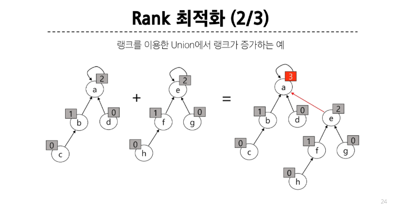

# 서로소 집합(Disjoint-set)  
서로소 또는 상호배타 집합들: 서로 중복 포함된 원소가 없는 집합들  
즉, 교집합이 X  

* 두 집합 간 공통 원소강 하나도 X: 서로소 집합  
* 집합에 속한 하나의 특정 멤버로 집합 구분: 대표자(representative)  

## 서로소 집합 표현 - 트리  

같은 집합의 원소들을 하나의 트리로 표현함  
자식 노드가 부모 노드를 가리키며 -> 루트 노드가 대표자가 됨  

`01_dsu_basic.py`에서 union 코드는 다음과 같이 구성함    
* **하지만!** 자료구조를 사용하는 이유: 탐색 시간을 줄이기 위해서(효율적으로 쓰기 위해서)  
```python
def union(x, y):
    '''
        x, y: 합쳐질 두 집합의 원소  
        유니온 과정에 삽입 대상 원소는 그 원소의 집합의 대표자가 아닐 수 있음  
    '''
    root_x = find_set(x)
    root_y = find_set(y)
    # 두 원소가 속한 집합의 대표자가 서로 다르다면,
    if root_x != root_y:
        # 원소 x가 속한 집합의 대표자를 y로 바꾸거나  
        parent[root_y] = root_x
```  

모든 union 연산을 끝낸 다음에도 같은 집합 소속인지 판단하기 위해서는 n번의 탐색이 필요함  
=> 비효율적  

## 서로소 집합의 최적화  
* Path compression  
  - Find-Set을 행하는 과정에서 만나는 모든 노드들이 직접 root를 가리키도록 포인터를 바꾸어줌  
* Rank를 이용한 Union  
  - 각 노드는 자신을 루트로 하는 subtree의 높이를 rank로 저장  
  - 두 집합을 합칠 때 rank가 낮은 집합을 rank가 높은 집합에 붙임  

### Path compression  
평탄화를 하는 과정에서 그냥 코드를 구현하면  
긴 트리로 출력됨  
여기에 대해 경로 압축 과정을 진행하면 -> O(n)만큼 돌게 됨  
하지만, union 함수 내에서 해당 작업을 진행하면 -> O(lgN)만큼 돌면 됨  

근데... 이렇게 하면 노드의 높이가 바뀌게 된다 - 트리의 깊이도 바뀜  

### Rank를 이용한 Union  

위처럼 랭크가 동일한 두 개의 트리를 union 할 때, 대표자의 rank만 1 증가함 - 나머지 자식들의 랭크는 그대로  

위처럼 랭크를 사용하면 도움이 되나? - 그냥 어떻게 생겼는지 알 수 있는 거 아닌가?  


### 경로 압축은 언제 일어나나  
자료구조를 사용할 때마다, 필요한 부분만 자동으로, 점진적으로 최적화  
=> 필요할 때 사용하면 된다. 부가적인 기능임  

### 경로 압축의 장점  
경로 압축 이후에 서로소 집합을 찾을 때(부모를 찾을 때) 시간복잡도가 `O(1)`이 된다.  
강의 중 예시는 편향된 집합인 것이고, 대체로 `O(logN)`
* Union 도중에도 필요하다면 경로 압축이 이루어질 수 있음  

### 랭크  
랭크를 사용하는 이유는, 각각 2와 3의 랭크를 가진 root들의 집합을 union 했을 때 가장 부모가 되는 노드의 랭크 증가를 예측하기 위함이다.  
