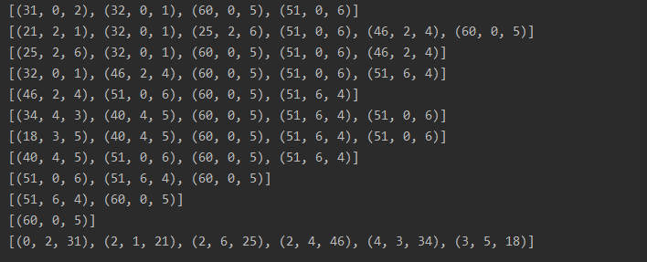

# 신장 트리  
그래프를 사이클 없는 트리 형태로 만든 것  

트리와 그래프에서는 노드가 가진 값과 간선이 중요함 - 순환을 많이 해왔기 때문에 간과할 수 있는 사실  

그래프에서부터 신장 트리를 만듦  

0번 노드를 루트로 했을 때, 0번 노드에서 방문할 수 있는 곳은 모두 체크  
하지만 모든 노드를 방문한 것은 아님  
2번 노드에서 갈 수 있는 모든 곳을 조회  

## 최소 신장 트리  
: 무향 가중치 그래프에서 신장 트리를 구하는 간선들의 가중치 합이 최소인 신장 트리  
**최단 경로와 헷갈리지 않도록 개념을 확실하게 잡기**  

### 최소 신장 트리를 사용하는 이유  
모든 노드로 이어지는 최소 비용을 알기 위함  
즉, 모든 노드들이 도달할 수 있는 어떤 길을 알기 위해서, 모든 가중치의 합이 최소가 될 수 있도록  

**어디에 쓰는 걸까?**  
네트워크망 연결 등에서 최소 신장 트리를 사용함  
또한, 데이터 마이닝 과정에서 클러스터링을 활용하는 것이 기존 K-means보다 효율적  
특정 단어를 기준으로 클러스터링을 하고 싶을 때, 최소 신장 트리를 사용하면 유사도가 높은 단어들 간의 군집으로, 여러 개의 트리를 만들 수 있음  

# 최소 신장 트리를 찾는 알고리즘  
- DFS, BFS로 찾을 수도 있음  
- KRUSKAL 알고리즘    
- PRIM 알고리즘  

# KRUSKAL 알고리즘  
간선을 하나씩 선택해서 MST를 찾는 알고리즘  
1. 모든 간선을 가중치에 따라 오름차순 정렬  
2. 가중치가 가장 낮은 간선부터 선택하며,  
    사이클 생기면 무시  
    사이클 생기지 않으면 선택    
    (서로소 집합의 `find_set`을 사용해 판단)  
3. **n-1개의 간선이 선택될 때까지** 2번 과정 반복  

# PRIM 알고리즘  
하나의 정점에서 연결된 간선 중 하나씩 선택하며 MST 만들어가는 방식  
1. 임의 정점을 하나 선택해 시작  
2. 우선순위 큐(최소힙)를 사용해 가중치가 가장 작은 간선 선택  
3. 가장 가중치 작은 간선 선택 / 방문 X이면 최소 신장 트리에 추가 - 방문 표시  
4. 우선순위 큐가 빌 때까지 반복  

어떤 노드에서 시작하든 상관 없다 - 모든 노드에 방문할 수 있는 최소 가중치를 구하는 것이기 때문에  
PRIM에서는 n-1개의 가지치기를 하는 것이 완탐 끝낸 이후가 되어도 늦지 않음  
=> 모든 후보군을 순회 완료 할 때까지 반복해야 하는 이유  
(+ 최악의 경우에는 n-1개까지 자르거나, min_heap의 모든 값을 순회하는 거나 똑같음)  

min_heap이기 때문에 루트 노드 이외에서는 순서가 보장되지 않음  

# 시간복잡도  
완탐으로 풀이할 경우: 모든 노드가 가진 모든 간선에 대해서 조사하는데, 이걸 모든 노드만큼 해야한다. -> O(E*(V+E))
크루스칼에서는: 