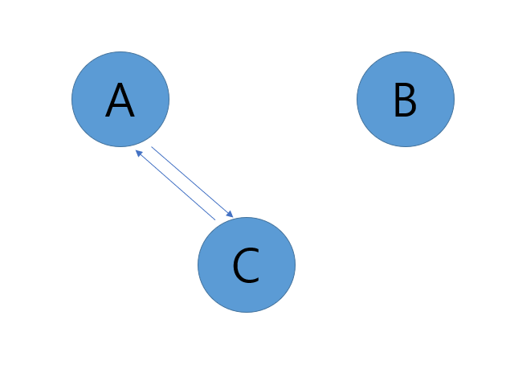

# 최단 경로  

특정 노드에서 다른 노드까지의 최단 경로를 구하는 것(최소 신장 트리와의 차이점)  

## 첫번째 아이디어 - 다익스트라)  
도착점까지 가장 짧았던 경로를 선택해오는 방법  
중간에 특정 노드까지의 새로운 경로가 기존의 경로와 같거나 길다면 굳이 선택하지 않음  
모든 길을 가보지 않고, 우선순위큐를 사용해서 이전에 방문한 적이 없고, 더 짧은 경로를 선택하는 방법  

- 다익스트라에서는 뒤에 오는 경로들이 기존 것보다 빠를 수 없음: 우선순위 큐를 사용하고, 가중치 중 음수가 없음을 background로 갖기 때문에 - 먼저 도착하는 경우, 이후에는 더 적은 가중치를 가질 수 없음  
  => 가중치에 음수가 있다면: 벨만-포드 알고리즘을 사용할 수 있음  

## 음수의 경로가 있을 때 - 벨만-포드 알고리즘)  
시작 정점에서 다른 모든 정점으로의 최단 경로를 구하는 알고리즘  
음수 가중치를 가져도 동작  

한편, 음수의 경로가 있으면 가중치가 적어지며 -> 늦게 도착해도 더 적은 가중치 합을 가질 수 있음  
- 마지막 노드만 제외하고 전체 노드 N개 중 N-1개에 대한 최단 경로를 구함  
- 계속 갱신이 되면: 음수 사이클이 있어 의미 없음을 알 수 있음  

`a -> b`가 3이고 `a -> c: 1` `c -> b: 1`일 때  
`u`가 `b`인 동안, `d`, `e`를 조회하고 값을 갱신  
=> `a -> b` 값이 3인 채로 `d`, `e`에 대한 경로가 갱신됨   
따라서, `(n-1)`만큼 돈다. **즉, 최단 경로를 활용해 뒤의 노드에 대한 최단 경로를 갱신함**    
전체 노드에 대한 조사를 해도 더 이상 갱신이 없다면 -> 반복문 종료  

- 벨만-포드 알고리즘에서도 음수사이클이 있는 경우에는 올바른 결과값을 얻을 수 없음 - `(n-1)`번을 한 번 더 하면 음수 사이클 존재 여부를 확인할 수 있음    

- 벨만-포드에서 inf임을 조사하는 이유: 이전에 인접한 노드가 없었던 정점은 조사하지 않고 지나간다.  
  
예를 들어, 위 같은 상황이라면 B가 u일 때, distances[u]는 `inf`일 수밖에 없다.  

## 플로이드-워셜 알고리즘  
: 모든 노드로부터 모든 노드까지의 최단 경로  
(다익스트라와 벨만 포드를 모든 노드에서 시작하면 되긴 함,,)  

**하지만!! 다익스트라 알고리즘과 시간 복잡도가 동일!!!!하며 구현 간단!!!!!!!**  

* 모든 정점에 대해 한다는 것이 중요함  