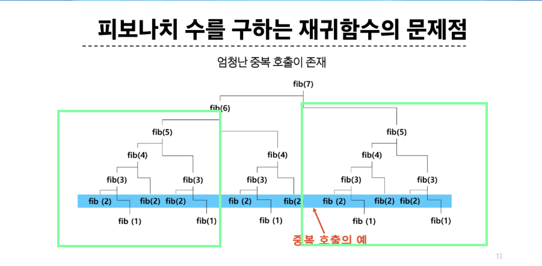

# memoization  
n번째의 결과를 얻기 위해서 이전의 값들을 저장해두는 배열 or 메모리를 memoization이라고 칭함  
* 추가적인 메모리 공간이 필요하다. - 문제마다 다름 / 아래에서는 N개만큼의 메모리  
* 재귀 함수 호출로 인한 시스템 호출 스택 사용 => 실행 속도 저하 or 오버플로우 발생 가능
**=> 입력 크기가 작은 부분문제 먼저 해결하는 bottom-up 방식으로 문제 해결 가능**  
예시)

```python
# top-down

def fibo(N):
    # 2보다 크거나 같고 0의 값을 갖고 있다면
    if N >= 2 and memo[N] == 0:
        # 한 번은 값들을 구해줘야 함
        # memo[N] = memo[N-1] + memo[N-2]
        memo[N] = fibo(N-1) + fibo(N-2)
    return memo[N]

memo = [0] * (101)  # 100을 구할 것이기 때문에
# f(100)을 얻기 위해서는 f(99), f(98)을 얻을 수 있어야
memo[0] = 0
memo[1] = 1

fibo(100)

```
`top-down` 방식(재귀)에서 연산 결과를 어딘가에 저장해두고 써먹는 것 (memoization)  

# Bottom-Up  
## 동적 계획법의 적용 요건  
1. 중복 부분문제 구조(Overlapping subproblems) - 앞의 해가 뒤의 해를 구하는 데 영향을 미침  
2. 최적 부분문제 구조(Optimal substructure) - 
** 어떤 부분에는 안 될 수 있음  
* 최적의 원칙이 적용되지 않는 예시: Longest Path 문제  

  
중복 부분문제 구조 예시: 어떤 해를 구하기 위한 호출 내용이 여러 군데에서 반복되는 것을 확인할 수 있음  

```python
# bottom-up

def fibo(N):
    if N  <= 1:
        return N

    # 함수 내에서 저장할 공간 생성
    dp = [0] * (N+1)
    dp[1] = 1

    # N번의 연산으로 값을 구할 수 있음
    for i in range(2, N+1):
        dp[i] = dp[i-1] + dp[i-2]
    return dp[N]
```

## 3단계 DP 적용 접근 방법  
1. 최적해 구조의 특성을 파악함 = 규칙이 있는지를 파악함    
  - 문제를 부분 문제로 나눔  
2. 최적해 값을 재귀적으로 정의  
3. 상향식 방법으로 최적해 값 계산(하향식 가능 = **당연히!** 상향식 가능)  

## 분할 정복 VS DP  
### 분할 정복  
* 연관 없는 부분 문제로 분할  
* 부분문제를 재귀적으로 해결  
* 부분문제 해를 결합  

### 비교  
* DP에는 부분 문제들 사이 의존적 관계 존재  
* 이런 관계는 문제에 따라 다르고, 대부분 뚜렷이 보이지 X -> 함축적인 순서  
* 분할 정복은 하향식 방법 & DP는 상향식 방법  

# DP - 예시  
## 이항계수  
: 이항 다항식 x + y의 거듭제곱에 대해서, 전개한 각 항의 계수 값을 구하는 정리  
** 수식 이해가 더 필요함  

동적 계획을 할 때, 메모리를 너무 많이 차지하게 됨  
2차원 리스트가 아니라 1차원 리스트로 만들 필요가 있음  
: 어디서부터 어떻게 줄일 수 있는지 생각해볼 필요가 있음  

## 동전 거스름돈  
### 문제와 기존 접근 방식    
* 1, 4, 6원  
* 8원을 거슬러 줄 때, 최소 몇 개의 동전을 거슬러 주면 되나?  
=> 그리디는 해결할 수 없음  

완탐으로 접근하다보면, 중복되는 요소들을 발견할 수 있음  
중복 부분 문제로 처리되고 있는 것을 발견 => DP로 풀이할 수 있을 것 같음  

### 상향식 접근  
* 1원에 대한 최적해 -> 2원에 대한 최적해 -> 3원에 대한 최적해 ...  
if n == 4:
C[n-1] + 1, C[n-4] + 1 = MIN(4, 1)  

Q) greedy로 풀 수 없던 문제들을 DP로는 풀 수 있음: 조건이 더 까다로운데 어떻게?  

`knapsack_optimized` 이해하기  
