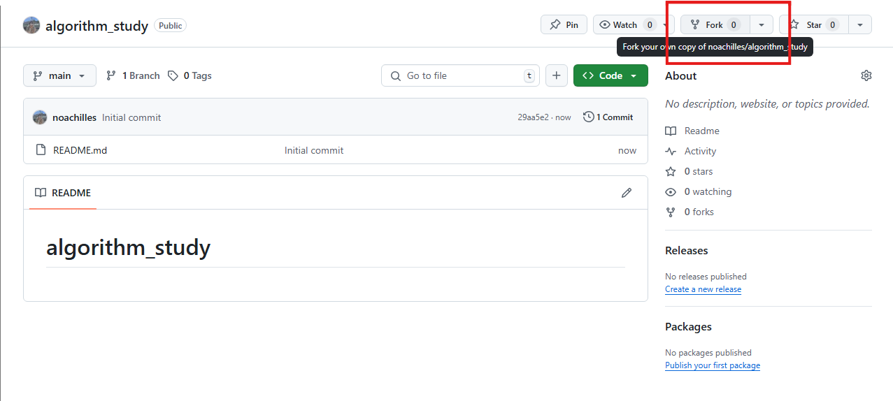
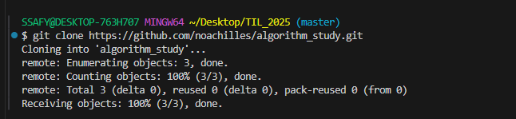
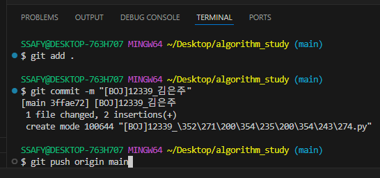
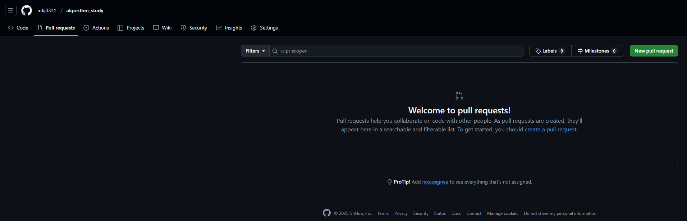
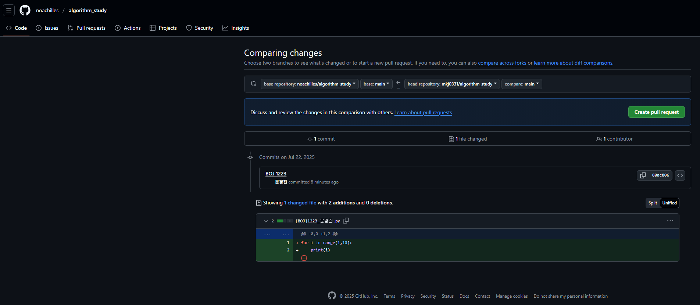
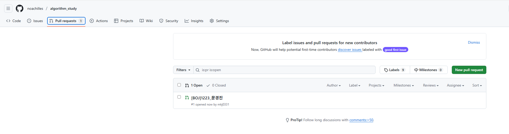
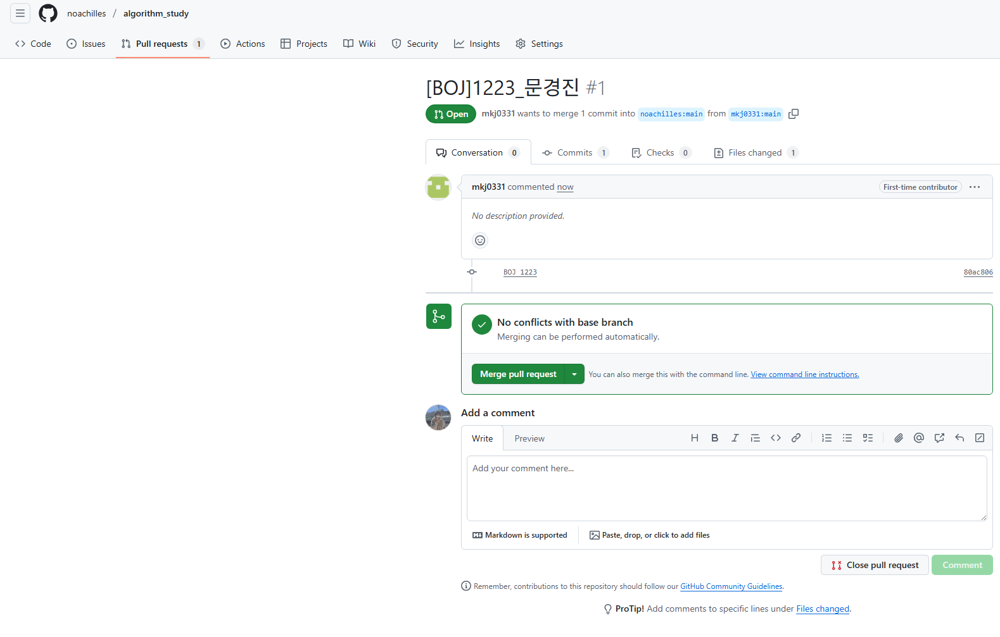
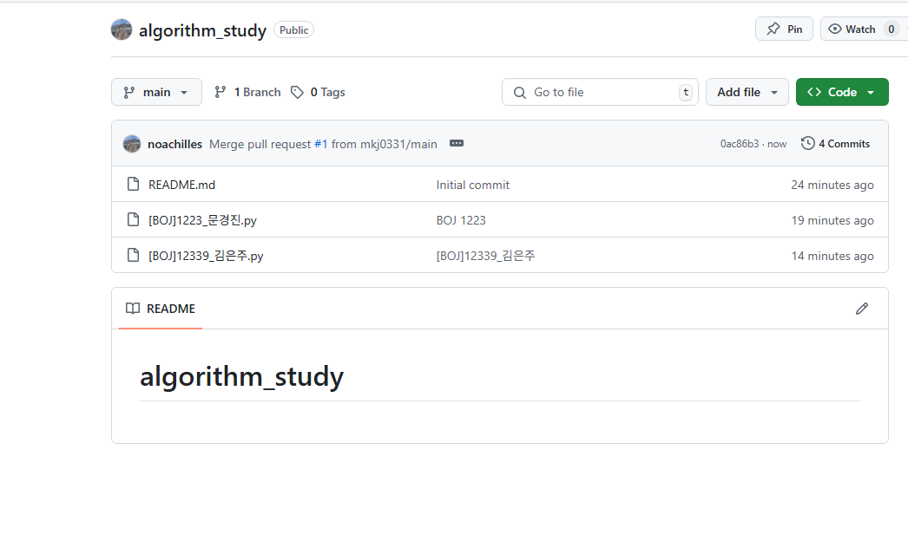

# GitHub를 활용해서 알고리즘 스터디 레포지토리 관리하기  
## GitHub Fork  
타인의 개인의 레포지토리에 기록을 남기며, 소위 얘기하는 '잔디를 심기' 위해 fork를 사용할 수 있습니다.  
#### fork란  
: 타인의 '원격저장소' 내용을 나의 '원격저장소'에 복사하는 기능입니다.  

#### fork는 어떻게 하나요?  
  
팀장의 레포지토리에 들어가, fork를 클릭하면 나의 원격저장소에 동일한 이름의 레포지토리가 생깁니다.    

  

팀장을 포함한 모든 팀원은 개인 레포지토리를 로컬 저장소에 `clone` 합니다. 

개인별 문제를 풀이하고, 이를 repository에 업로드합니다.  

별도 설정하지 않았으면 기본 branch name은 `main`으로 설정되어 있습니다. `push`할 때 참고해주세요.  

  
파일명과 commit은 양식을 지정하고, 이를 따라주시면 나중에 정리된 내용을 확인하기 쉽습니다!  

  

